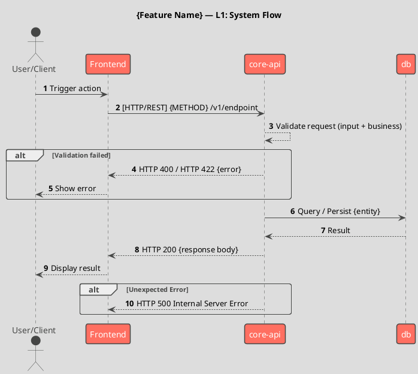
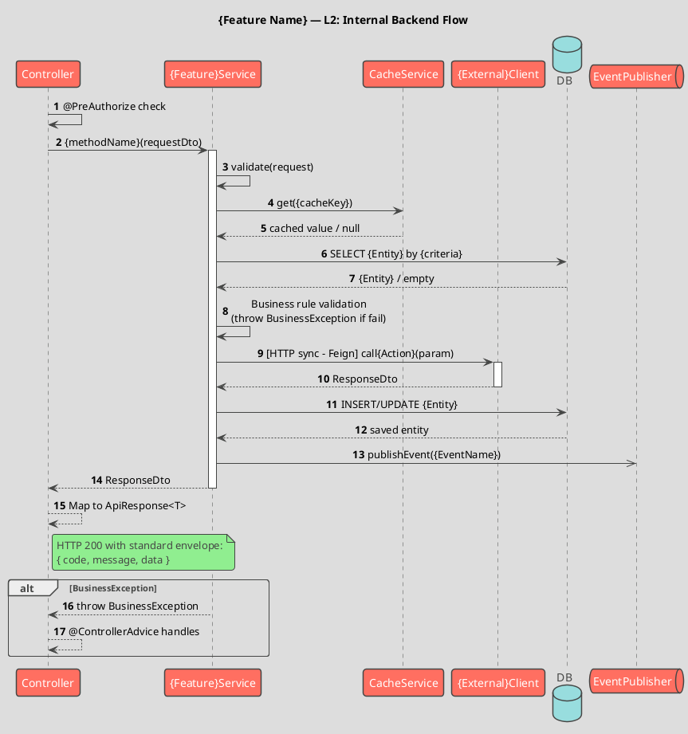

# Sequence Diagram Generator

Generate AsciiDoc files with embedded PlantUML sequence diagrams by reading source code and tracing how systems call each other through an API endpoint. Output always includes **two diagram levels** (L1 system-level + L2 internal backend) with a **mandatory confirmation gate** before rendering.

## Overall Approach

Think of yourself as a detective following a thread through the codebase. Start at the controller, read the code carefully, identify every outbound call, then follow each one — recursively — until you reach system boundaries you can't cross. At those boundaries, ask the user for guidance. Collect every participant and message along the way.

**Before rendering any diagram**, present your findings to the user for confirmation. Only after the user approves do you generate the PlantUML output.

The goal is **accuracy over speed**. Read actual code; don't guess system names, topic names, or endpoint paths. When you're unsure about something, ask.

---

## Step 1: Understand the Request

Parse the user's request to identify:
- **Entry point**: HTTP method + path (e.g., `POST /v2/sdk/bank/onboard`), or a feature name
- **Output path**: default is `docs/diagrams/<endpoint-slug>-sequence.adoc`
    - Slug: lowercase, replace `/` with `-`, strip leading `-`
    - Example: `POST /v2/sdk/bank/onboard` → `docs/diagrams/v2-sdk-bank-onboard-sequence.adoc`

If the endpoint is ambiguous (multiple matches), list the candidates and ask the user to choose.

---

## Step 2: Find the Controller Method

Search for the Spring Boot controller that handles the endpoint:

**What to look for:**
- Classes annotated with `@RestController`
- Method annotations: `@GetMapping`, `@PostMapping`, `@PutMapping`, `@DeleteMapping`, `@PatchMapping`, `@RequestMapping`
- The path can be split between class-level and method-level `@RequestMapping`

**How to search:**
- Grep for the path string (e.g., `/onboard`) across `*.java` files
- Confirm the full path matches (class prefix + method path)
- Read the full controller method

**Communicate:** "I found the controller at `{ClassName}.java:{line}`. Reading it now."

---

## Step 3: Trace Outbound Calls Recursively

For every call made in the code path, identify the type and follow it deeper.

### 3a. Service layer calls
When the controller delegates to a `@Service` class, read that service implementation. Keep following the call chain through helpers and sub-services.

### 3b. HTTP / REST calls (Feign, RestTemplate, OkHttp, WebClient)

**Feign clients** — most common in Spring microservices:
- Look for interface fields/parameters of type `@FeignClient`-annotated interfaces
- Read the Feign interface to get the target service name (from `name` or `url` in `@FeignClient`) and the endpoint path
- Check if the target service's code exists in the current repo
    - If yes: find its controller for that path and recurse
    - If no: go to Step 4 (external system)

**RestTemplate / OkHttp / WebClient:**
- Extract the URL or path being called
- Same decision: in repo → recurse; not in repo → Step 4

### 3c. Kafka (Message Broker)

**Producer** — look for:
- `kafkaTemplate.send(topic, ...)` or similar producer API
- Extract the **exact topic name** string

Then search the current repo for a consumer of that topic:
- `@KafkaListener(topics = "...")` or `@KafkaListener(topics = {"..."})`
- Also check `@KafkaListener` with topic from a `${}` config property — if so, look up the property value in `application.yml` / `application.properties`

If consumer found in repo: read the listener method and recurse.
If not found: go to Step 4.

> 🔴 **CRITICAL:** **ABSOLUTELY DO NOT** fabricate or invent service names. If you know there is a Kafka consumer but do not know its actual service name, you **MUST ASK**. Do NOT arbitrarily name it `notification-service` or `email-service`.

**Consumer** — if the entry point IS a `@KafkaListener`:
- Search the project for the producer of that topic
- If not found → ask: "This flow has a Kafka consumer but I cannot find any producer in the project. Which service is the producer?"

> ⚠️ This rule applies **in both directions**: producer → need to know consumer; consumer → need to know producer.

**Async nature:** Kafka messages are async. Represent the produce as `->>` (async arrow) and the consume as a separate activation block.

### 3d. gRPC

**Stub calls** — look for:
- Fields of type `*Stub` or `*BlockingStub`
- Calls like `stub.methodName(request)`
- Read the proto service name and method from the stub type

Search the current repo for the gRPC server implementation:
- Classes that `extends *ImplBase` or implement the generated service interface

If found: read the implementation and recurse.
If not found: go to Step 4.

### 3e. Database calls
- Represent as: `Service -> DB: <operation> <EntityName>`
- Do **not** recurse into repository/DAO internals
- Use the entity name, not the table name (e.g., `INSERT UserProfile`, not `INSERT TB_USER_PROFILE`)

### Stop Conditions
- You've reached a true leaf (no more outbound calls)
- The user asks you to stop going deeper at a certain point
- You've already traced this same component (avoid infinite loops — track what you've visited)

---

## Step 4: Handle External Systems

When a call target's code is **not** in the current repo, pause and ask the user:

> "The flow calls **[SystemName]** via [Kafka topic `topic-name` / REST `METHOD /path` / gRPC `ServiceName.Method`], but I don't see its code in this repo.
>
> What would you like to do?
> 1. Point me to a local path where its repo is checked out — I'll trace inside it
> 2. Treat it as a black box — I'll show the call and response without going deeper
> 3. Skip this call entirely"

- **Option 1**: Read code from the provided path and continue tracing from there. Track which repo you're in for participant naming.
- **Option 2**: Add the system as a participant in the diagram. Draw the outgoing arrow, optionally add a return arrow with a generic response label.
- **Option 3**: Omit from diagram entirely.

> 🔴 **DO NOT** use generic names like "notification-service" or "unknown-consumer" in the diagram. You must get the exact service name from the user before proceeding.

---

## Step 5: Confirm Findings Before Drawing (MANDATORY GATE)

> 🔴 **Do NOT generate any diagram until this step is complete and the user confirms.**

After completing all tracing (Steps 2–4), present a structured summary to the user:

```
Based on my code analysis, here is what I found:

**Endpoint:** {METHOD} {/path}
**Controller:** {ClassName}.java:{line}

**Participants discovered:**
| # | Name | Type | Communication | Description |
|---|------|------|---------------|-------------|
| 1 | {name} | Service | — | Entry point |
| 2 | {name} | Service | [HTTP/REST] | Called via Feign |
| 3 | {name} | Message Broker | [Kafka async] | Topic: {topic} |
| 4 | {name} | Database | — | Data store |
| ... | ... | ... | ... | ... |

**Flow summary:**
1. Client → {service}: {action}
2. {service} → {service2}: {action}
3. ...

**Levels to draw:** L1 (System-level) + L2 (Internal backend)

Does this look correct? Any participants or steps I'm missing?
```

**Wait for user confirmation before proceeding to Step 6.**

If the user corrects or adds information, update the findings accordingly and re-confirm if the changes are significant.

---

## Step 6: Build the Diagrams

Once the user confirms, generate both L1 and L2 diagrams.

### PlantUML Standards (apply to EVERY diagram)

```plantuml
@startuml
!theme toy
autonumber
skinparam sequenceMessageAlign center
skinparam responseMessageBelowArrow true

title {Feature Name} — {L1/L2}

' ... participants and messages ...

@enduml
```

### Arrow Notation Rules

| Situation | Arrow | Example |
|-----------|-------|---------|
| Sync call (awaits response) | `->` | `fe -> be: [HTTP/REST] POST /v1/docs` |
| Async call (fire-and-forget) | `->>` | `be ->> kafka: [Kafka async] publish event` |
| Response / return | `-->` | `be --> fe: HTTP 200 {data}` |
| Internal call (same process) | `->` same participant | `svc -> svc: process internally` |

### Protocol Label Convention

Attach a protocol label to **every** cross-service arrow:

| Protocol | Label |
|----------|-------|
| REST HTTP | `[HTTP/REST]` |
| gRPC | `[gRPC]` |
| Kafka | `[Kafka async]` |
| RabbitMQ | `[AMQP async]` |
| Redis pub/sub | `[Redis pub/sub]` |
| Feign Client (sync) | `[HTTP sync - Feign]` |
| Internal (same service) | *(no label needed)* |

### 6a. L1 — System-Level Diagram

Shows the high-level communication between services, actors, and infrastructure.

> 🔴 **Rules for participants:**
> - **DO NOT** add API Gateway — the request has already passed through the gateway.
> - **DO NOT** add auth-service — the token has already been validated upstream.
> - **DO NOT** add any service not confirmed by the user or found in code.
> - Only declare components the **user has confirmed** or that you **found via code tracing**.



### 6b. L2 — Internal Backend Diagram

Shows the detailed flow **within** the backend service boundaries. Focus on architecturally significant components (Controller, Service, Engine, external-service clients). Collapse data-access layers (Repository, DAO) into direct `Service → DB` arrows — consistent with Step 3e.

Use `activate`/`deactivate` for synchronous call blocks. Use `alt`/`opt`/`loop` for conditional branches found in the code.

> 🔴 **Rules for L2 participants:**
> - **Participant budget:** Aim for **≤ 6–7 participants**. If you exceed this, collapse lower-value layers first (Repository/DAO → merge into Service → DB arrows).
> - **DO NOT** add Repository/DAO as separate participants — represent data access as `Service -> DB: <operation> <EntityName>` (this is the same rule as Step 3e).
> - **DO NOT** add external systems that already appear in L1 — L2 stops at the **outbound client/adapter boundary** within this service (e.g., show `FeignClient` or `KafkaProducer` but NOT the external system on the other side).
> - **DO** add architecturally meaningful internal components: strategy classes, mapping engines, adapters, orchestrators, external-service client wrappers.
> - When in doubt, ask: *"Does this participant reveal an architectural decision, or is it just implementation plumbing?"* If plumbing → collapse.



---

## Step 7: Write the .adoc File

### File Naming
- Pattern: `{feature-name}-sequence.adoc`
- Examples: `v2-sdk-bank-onboard-sequence.adoc`, `document-create-sequence.adoc`
- Default location: `docs/diagrams/` of the relevant module
- If the directory doesn't exist, create it
- If the file already exists, ask: "A file already exists at `{path}`. Overwrite or save to a different path?"

### Output File Structure

```asciidoc
= Sequence Diagram: {Feature Name}
:api: {METHOD} {/endpoint}
:author: {requester name if known}
:revnumber: 1.0
:revdate: {YYYY-MM-DD}
:toc:

== Overview

Describes the flow for `{METHOD} {/path}` — {brief feature description}.

== Participants

|===
| Name | Type | Description

| {service-name}
| Service
| {role description}

| {kafka-topic}
| Message Broker (Kafka)
| {topic purpose}

| {database-name}
| Database
| {data store description}

|===

'''

== L1 — System-Level Flow

[plantuml, {feature-name}-l1, svg]
....
@startuml
' ... L1 diagram content ...
@enduml
....

'''

== L2 — Internal Flow (Backend)

[plantuml, {feature-name}-l2, svg]
....
@startuml
' ... L2 diagram content ...
@enduml
....

'''

== Notes

* {Key business logic, edge cases, special handling}
* {Async vs sync decision rationale}
* {Any assumptions made during tracing}
```

After saving, tell the user the exact path of the saved file.

---

## Step 8: Offer to Continue

After saving, ask the user:

> "The diagram has been saved to `{path}`. Does it look complete, or would you like me to:
> 1. Trace deeper into any particular service (e.g., what **[SystemName]** does internally)?
> 2. Add more error/edge case flows?
> 3. Adjust the diagram in any way?"

If the user wants to go deeper into an external system they previously chose to treat as a black box, switch to Option 1 from Step 4 and re-trace.

---

## What to Communicate to the User

Be transparent at each step:
- "I found the controller at `{ClassName}.java:{line}`. Reading it now."
- "This calls `{ClientName}.{method}()` — tracing into the target service."
- "I see a Kafka produce to topic `{topic}` but no consumer in this repo. What should I do?"
- "I've traced {N} hops: {A} → {B} → {C}. Ready to present findings for your confirmation."

Don't silently skip things. If something is ambiguous (two consumers for the same topic, a dynamic topic name), flag it explicitly.

---

## Tips for Reading Java/Spring Boot Code

- **Controllers:** `@RestController` classes — check both class-level and method-level `@RequestMapping` for full path
- **Service layer:** `@Service` in `service/impl/` — read the implementation, not just the interface
- **Feign clients:** `@FeignClient` interfaces — check `name` and `url` attributes for target service identification
- **Kafka producers:** `kafkaTemplate.send(topic, payload)` — topic is often a constant or config property
- **Kafka consumers:** `@KafkaListener` — check topic value; resolve `${...}` from `application.yml`
- **Config properties:** `src/main/resources/application.yml` — for resolving `${...}` topic names, URLs, etc.
- **Helper classes:** `helper/` packages — often contain the real business logic, not just the service layer
- **gRPC stubs:** `*Stub` or `*BlockingStub` fields — trace to proto service definitions

---

## Quality Checklist (Before Output)

Check before producing the file:

- [ ] **Output file is `.adoc`** with correct AsciiDoc header (title, api, author, revnumber, revdate, toc)
- [ ] **Participants table** complete with all discovered components
- [ ] **PlantUML blocks** use AsciiDoc `[plantuml, {diagram-id}, svg]` block delimiter (`....`)
- [ ] **L1 diagram** correctly shows actors and cross-service communication
- [ ] **L2 diagram** shows internal components with data-access collapsed (`Service → DB`), no separate Repository participants, and ≤ 6–7 participants total
- [ ] **Every cross-service arrow** has a protocol label (`[HTTP/REST]`, `[Kafka async]`, etc.)
- [ ] **Alt/else blocks** for important error cases
- [ ] **Async calls** use `->>` ; sync calls use `->`
- [ ] **HTTP status codes** written on response arrows
- [ ] **activate/deactivate** used for sync call blocks
- [ ] **Note boxes** for complex business logic (if needed)
- [ ] `autonumber`, `!theme toy`, `skinparam` settings all present
- [ ] **Notes section** includes key observations and assumptions
- [ ] **Confirmation gate** was completed (Step 5) before diagram was generated
- [ ] **Security checkpoint** marked for auth/authz steps (if applicable)

---

## Anti-Patterns

| Wrong | Correct |
|-------|---------|
| Assuming communication method | Ask clearly before drawing |
| Fabricating service names (e.g., `notification-service`) | Omit and **MUST ASK** if the name is unknown |
| Adding API Gateway to L1 | Omit — token is validated upstream |
| Adding auth-service to L1 | Omit — auth is handled before backend |
| Adding unconfirmed services | MUST ASK before adding any service |
| Kafka detected but no consumer search | Scan project; if not found → MUST ASK |
| Skipping the confirmation gate (Step 5) | ALWAYS present findings and wait for user approval |
| Generating only L1 or only L2 | Always generate both L1 + L2 |
| Arrow without label for cross-service | Every cross-service arrow must have `[Protocol]` label |
| Skipping error/exception flow | Always include at least 1 `alt` block for errors |
| Output as raw `.puml` or `.md` | Output must always be `.adoc` with AsciiDoc `[plantuml]` block |
| Generic file name | File name must follow `{feature-name}-sequence.adoc` |
| Silently skipping ambiguous calls | Flag explicitly and ask the user |
| Guessing class names or method names | Read actual code; quote exact names |
| L2 with Repository/DAO as separate participants | Collapse to `Service -> DB: <operation> <Entity>` |
| L2 exceeding 6–7 participants | Collapse low-value layers (Repository, DAO, helpers) first |
| L2 showing external systems (already in L1) | Stop at outbound client/adapter boundary within the service |
