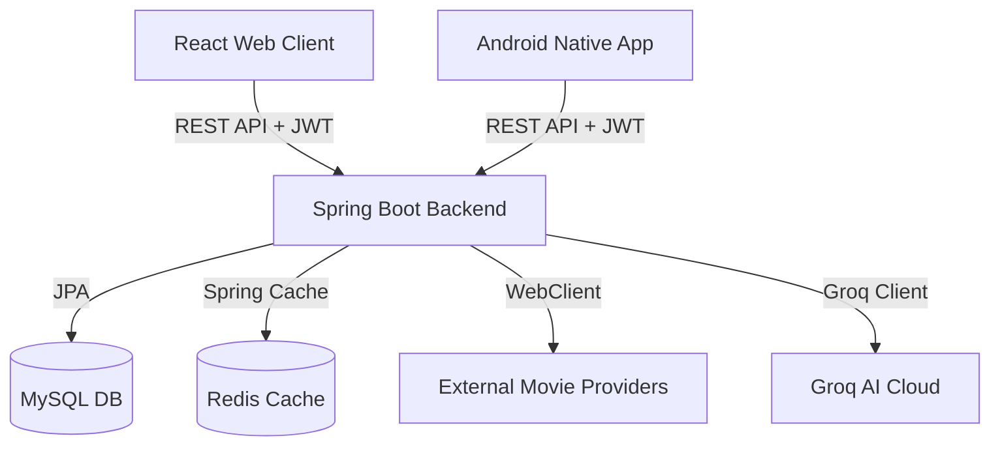

# 🎬 CineStream - Hệ Sinh Thái Xem Phim Toàn Diện (Full-Stack)

CineStream là một hệ sinh thái xem phim cao cấp (full-stack) được thiết kế đồng bộ để mang lại trải nghiệm xem phim mượt mà và hiện đại trên cả nền tảng **Web** và **Android**. Hệ thống được tối ưu hóa từ lõi backend Spring Boot, giao diện web React phong cách Obsidian sang trọng, đến ứng dụng Android Native sử dụng Jetpack Compose.

---

## 🏗️ Kiến Trúc Hệ Thống

Hệ sinh thái CineStream chia tách rõ ràng trách nhiệm giữa ba thành phần chính, giao tiếp qua RESTful APIs bảo mật:



### 1. 🖥️ [Backend API](web-film-backend) (Spring Boot)
Động cơ cốt lõi của hệ thống, quản lý cơ sở dữ liệu, bảo mật, tối ưu hóa lưu trữ và tích hợp AI.
- **Framework**: Spring Boot 3.4+ & Java 21.
- **Bảo mật**: Xác thực phi trạng thái (stateless) qua **Spring Security**, mã hóa mật khẩu bằng BCrypt và cơ chế **JWT với Refresh Token Rotation** (xoay vòng token).
- **Tối ưu hóa**: Sử dụng **Redis** lưu bộ nhớ đệm (caching) các danh mục phim phổ biến để giảm tải cho MySQL và tăng tốc độ phản hồi API.
- **Tự động hóa**: Bộ thu thập dữ liệu tự động (**Crawler**) bằng **WebClient** giúp đồng bộ và làm mới dữ liệu phim từ các nguồn bên ngoài.
- **Kiểm soát**: **Rate Limiting Filter** tự động giới hạn số lượng request từ IP để bảo vệ hệ thống khỏi tấn công DDoS và Spam.

### 2. 🌐 [Web Frontend](web-film-frontend) (React)
Ứng dụng web mượt mà, phản hồi nhanh, giao diện tối màu Obsidian thời thượng kết hợp hiệu ứng chuyển động cao cấp.
- **Framework**: React 19, TypeScript, **Vite** tối ưu hóa hiệu năng biên dịch.
- **Styling**: **Tailwind CSS 4.0** với các biến CSS gốc và khả năng tương thích cao.
- **Quản lý trạng thái**: Kết hợp **Zustand** (trạng thái toàn cục) và **TanStack Query** (đồng bộ hóa dữ liệu server, tự động làm mới, cache client).
- **Trình phát video**: Trình phát **Vidstack** tùy biến cao hỗ trợ luồng phát trực tiếp **HLS (HTTP Live Streaming)**.

### 3. 📱 [Ứng dụng Mobile](web-film-android) (Android Native)
Ứng dụng di động mượt mà, tối ưu hóa phần cứng thiết bị.
- **UI Framework**: 100% **Jetpack Compose** kết hợp với Material 3 design system mang lại hiệu ứng gợn sóng, shimmer loading mượt mà.
- **Quản lý phụ thuộc**: **Hilt (Dagger)** tiêm phụ thuộc toàn diện.
- **Lưu trữ nội bộ**: **Room Database** lưu lịch sử xem phim và danh sách yêu thích hỗ trợ offline.
- **Trình phát video**: **Media3 ExoPlayer** tối ưu hóa cho phát luồng HLS trực tuyến, tự động chuyển tập, nhớ tiến trình xem.

---

## 🚀 Các Tính Năng Premium

### 🤖 Trò Chuyện & Gợi Ý Phim Từ AI
Tích hợp trực tiếp **Groq AI SDK** tại backend, cho phép người dùng trò chuyện trực tiếp với trợ lý phim ảnh ảo trên ứng dụng Android để nhận các đề xuất phim thông minh dựa trên sở thích cá nhân.

### 📥 Tải Phim Ngoại Tuyến (Offline Download)
Ứng dụng Android hỗ trợ tải trực tiếp các tập phim về thiết bị thông qua hệ thống **DownloadManagerWrapper**, cho phép người dùng thưởng thức phim chất lượng cao bất kể lúc nào mà không cần kết nối Internet.

### 🔍 Tìm Kiếm & Lọc Đa Chiều Nâng Cao
Hệ thống hỗ trợ tìm kiếm toàn cục thời gian thực, lọc động cùng lúc theo nhiều thể loại (17+ danh mục), quốc gia, năm phát hành vô cùng mượt mà.

---

## 🛠️ Chi Tiết Công Nghệ

| Lớp | Công nghệ sử dụng |
| :--- | :--- |
| **Backend** | Java 21, Spring Boot, Spring Security, JWT, MySQL, Redis, MapStruct, Swagger |
| **Frontend** | React 19, TypeScript, Tailwind CSS 4, TanStack Query, Zustand, Framer Motion |
| **Android** | Kotlin, Jetpack Compose, Hilt, Room, Retrofit, OkHttp, Media3 ExoPlayer, Coil |
| **Hạ tầng** | Docker, Docker Compose, GitHub Actions (CI/CD) |

---

## 📁 Cấu Trúc Dự Án

```text
web-film/
├── web-film-backend/    # Spring Boot REST API & Crawlers
├── web-film-frontend/   # React (Vite) Web Application
└── web-film-android/    # Dự án Android Native (Compose)
```

---

## 🏁 Hướng Dẫn Bắt Đầu Nhanh

Để chạy toàn bộ hệ sinh thái, hãy làm theo hướng dẫn chi tiết trong từng thư mục thành phần:

1. **Backend**: [Hướng dẫn thiết lập Backend](web-film-backend/README.md)
2. **Frontend**: [Hướng dẫn thiết lập Frontend](web-film-frontend/README.md)
3. **Android**: Mở thư mục `web-film-android` bằng **Android Studio** (Ladybug trở lên) và chạy trên thiết bị ảo/thật.

---

## 📄 Bản Quyền
Dự án được phát triển bởi **Tam Dao**. Mọi quyền được bảo lưu.
