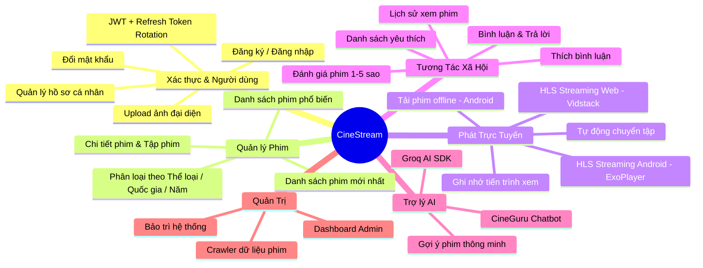
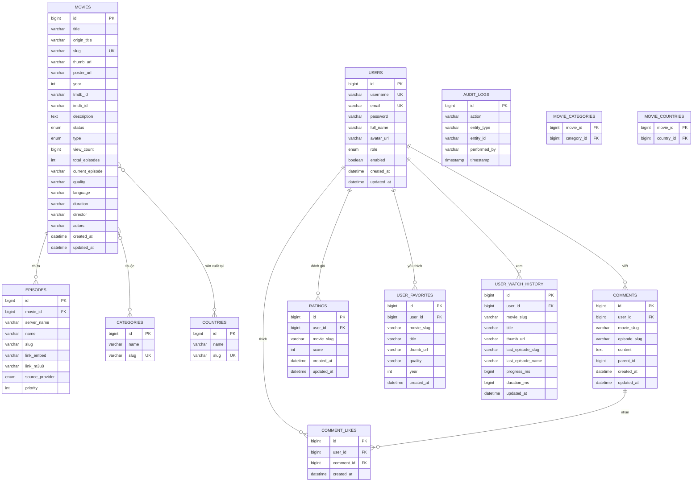
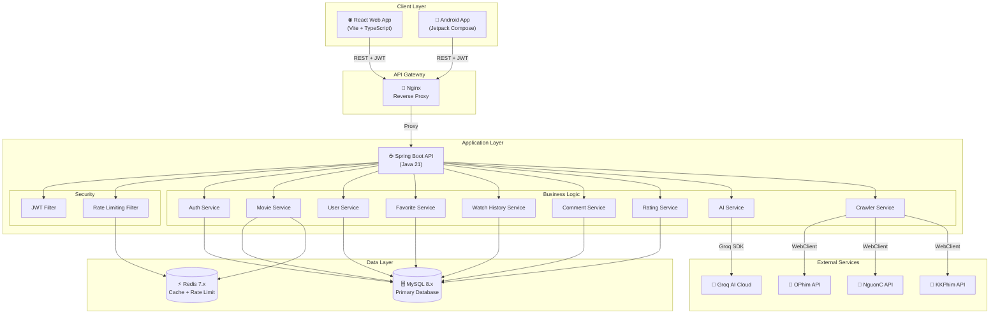

# 📄 Tài Liệu Đặc Tả Yêu Cầu Phần Mềm (SRS)
## Dự Án: CineStream — Hệ Sinh Thái Xem Phim Toàn Diện

| Thông tin       | Chi tiết                                      |
| :-------------- | :-------------------------------------------- |
| **Phiên bản**   | 1.0                                           |
| **Ngày tạo**    | 10/06/2026                                    |
| **Tác giả**     | Tam Dao                                       |
| **Trạng thái**  | Draft                                         |

---

## Mục Lục

- [1. Giới Thiệu](#1-giới-thiệu)
  - [1.1. Mục Đích](#11-mục-đích)
  - [1.2. Phạm Vi Dự Án](#12-phạm-vi-dự-án)
  - [1.3. Đối Tượng Sử Dụng Tài Liệu](#13-đối-tượng-sử-dụng-tài-liệu)
  - [1.4. Thuật Ngữ và Viết Tắt](#14-thuật-ngữ-và-viết-tắt)
  - [1.5. Tài Liệu Tham Khảo](#15-tài-liệu-tham-khảo)
- [2. Mô Tả Tổng Quan](#2-mô-tả-tổng-quan)
  - [2.1. Tầm Nhìn Sản Phẩm](#21-tầm-nhìn-sản-phẩm)
  - [2.2. Chức Năng Chính](#22-chức-năng-chính)
  - [2.3. Đặc Điểm Người Dùng](#23-đặc-điểm-người-dùng)
  - [2.4. Môi Trường Hoạt Động](#24-môi-trường-hoạt-động)
  - [2.5. Ràng Buộc Thiết Kế và Triển Khai](#25-ràng-buộc-thiết-kế-và-triển-khai)
  - [2.6. Giả Định và Phụ Thuộc](#26-giả-định-và-phụ-thuộc)
- [3. Yêu Cầu Chức Năng](#3-yêu-cầu-chức-năng)
  - [3.1. Quản Lý Tài Khoản (Authentication & User Management)](#31-quản-lý-tài-khoản-authentication--user-management)
  - [3.2. Quản Lý Phim (Movie Management)](#32-quản-lý-phim-movie-management)
  - [3.3. Phát Trực Tuyến & Xem Phim (Streaming & Playback)](#33-phát-trực-tuyến--xem-phim-streaming--playback)
  - [3.4. Tương Tác Người Dùng (User Interaction)](#34-tương-tác-người-dùng-user-interaction)
  - [3.5. Tìm Kiếm & Lọc Phim (Search & Filter)](#35-tìm-kiếm--lọc-phim-search--filter)
  - [3.6. Trợ Lý AI Chatbot (AI CineGuru)](#36-trợ-lý-ai-chatbot-ai-cineguru)
  - [3.7. Quản Trị Hệ Thống (Admin Panel)](#37-quản-trị-hệ-thống-admin-panel)
  - [3.8. Thu Thập Dữ Liệu Tự Động (Data Crawler)](#38-thu-thập-dữ-liệu-tự-động-data-crawler)
- [4. Yêu Cầu Phi Chức Năng](#4-yêu-cầu-phi-chức-năng)
- [5. Mô Hình Dữ Liệu](#5-mô-hình-dữ-liệu)
  - [5.1. Sơ Đồ ER (Entity-Relationship)](#51-sơ-đồ-er-entity-relationship)
  - [5.2. Mô Tả Chi Tiết Bảng Dữ Liệu](#52-mô-tả-chi-tiết-bảng-dữ-liệu)
- [6. Kiến Trúc Hệ Thống](#6-kiến-trúc-hệ-thống)
  - [6.1. Sơ Đồ Kiến Trúc Tổng Quan](#61-sơ-đồ-kiến-trúc-tổng-quan)
  - [6.2. Kiến Trúc Backend](#62-kiến-trúc-backend)
  - [6.3. Kiến Trúc Frontend (Web)](#63-kiến-trúc-frontend-web)
  - [6.4. Kiến Trúc Mobile (Android)](#64-kiến-trúc-mobile-android)
- [7. Đặc Tả API Endpoints](#7-đặc-tả-api-endpoints)
- [8. Giao Diện Người Dùng](#8-giao-diện-người-dùng)
  - [8.1. Giao Diện Web](#81-giao-diện-web)
  - [8.2. Giao Diện Android](#82-giao-diện-android)
- [9. Phụ Lục](#9-phụ-lục)

---

## 1. Giới Thiệu

### 1.1. Mục Đích

Tài liệu Đặc Tả Yêu Cầu Phần Mềm (Software Requirements Specification - SRS) này nhằm mô tả đầy đủ, chi tiết và có cấu trúc các yêu cầu chức năng, phi chức năng, kiến trúc hệ thống và mô hình dữ liệu của dự án **CineStream**. Tài liệu này phục vụ mục đích:

- Làm cơ sở cho việc thiết kế, phát triển và kiểm thử hệ thống.
- Đảm bảo sự thống nhất giữa các thành viên trong quá trình phát triển.
- Làm tài liệu tham chiếu chính thức cho toàn bộ dự án.

### 1.2. Phạm Vi Dự Án

**CineStream** là một hệ sinh thái xem phim toàn diện (full-stack) bao gồm ba thành phần chính:

1. **Backend API** (Spring Boot): Cung cấp RESTful API, quản lý dữ liệu, xác thực, bộ nhớ đệm và tích hợp AI.
2. **Web Frontend** (React): Ứng dụng web single-page application (SPA) với giao diện Obsidian sang trọng.
3. **Mobile Application** (Android Native): Ứng dụng di động sử dụng Jetpack Compose với Material 3 design system.

Hệ thống hỗ trợ người dùng duyệt, tìm kiếm, xem phim trực tuyến (HLS Streaming), quản lý danh sách yêu thích, lịch sử xem, bình luận, đánh giá phim và tải phim ngoại tuyến (Android). Ngoài ra, hệ thống tích hợp trợ lý AI thông minh để gợi ý phim.

### 1.3. Đối Tượng Sử Dụng Tài Liệu

| Đối tượng            | Mục đích sử dụng                                        |
| :------------------- | :------------------------------------------------------- |
| Nhà phát triển       | Hiểu yêu cầu chi tiết để thiết kế và lập trình          |
| Kiểm thử viên (QA)  | Xây dựng kịch bản kiểm thử dựa trên yêu cầu chức năng  |
| Quản lý dự án (PM)   | Theo dõi tiến độ và phạm vi dự án                        |
| Giảng viên / Hội đồng| Đánh giá mức độ hoàn thiện và chuyên nghiệp của dự án    |

### 1.4. Thuật Ngữ và Viết Tắt

| Thuật ngữ     | Giải thích                                                                 |
| :------------ | :------------------------------------------------------------------------- |
| **SRS**       | Software Requirements Specification — Đặc tả Yêu cầu Phần mềm            |
| **API**       | Application Programming Interface — Giao diện Lập trình Ứng dụng          |
| **REST**      | Representational State Transfer — Kiến trúc API phổ biến                   |
| **JWT**       | JSON Web Token — Cơ chế xác thực phi trạng thái (stateless)               |
| **HLS**       | HTTP Live Streaming — Giao thức phát trực tuyến video                      |
| **SPA**       | Single Page Application — Ứng dụng web đơn trang                          |
| **CRUD**      | Create, Read, Update, Delete — Các thao tác cơ bản trên dữ liệu          |
| **ORM**       | Object-Relational Mapping — Ánh xạ đối tượng - cơ sở dữ liệu             |
| **DI**        | Dependency Injection — Tiêm phụ thuộc                                      |
| **CI/CD**     | Continuous Integration / Continuous Deployment                              |
| **Crawler**   | Bộ thu thập dữ liệu tự động từ các nguồn bên ngoài                       |
| **Rate Limiting** | Giới hạn tần suất request để chống DDoS/Spam                          |

### 1.5. Tài Liệu Tham Khảo

- IEEE 830-1998: IEEE Recommended Practice for Software Requirements Specifications.
- Spring Boot 3.4 Official Documentation.
- React 19 Official Documentation.
- Android Jetpack Compose Official Documentation.
- Swagger/OpenAPI 3.0 Specification.

---

## 2. Mô Tả Tổng Quan

### 2.1. Tầm Nhìn Sản Phẩm

CineStream hướng tới mục tiêu trở thành nền tảng xem phim trực tuyến đa nền tảng (cross-platform) với trải nghiệm cao cấp, hiệu năng cao và giao diện sang trọng. Hệ thống được thiết kế đồng bộ trên cả Web và Android, đảm bảo tính nhất quán về trải nghiệm người dùng và dữ liệu.

### 2.2. Chức Năng Chính



### 2.3. Đặc Điểm Người Dùng

Hệ thống phục vụ ba nhóm người dùng chính:

| Nhóm người dùng     | Mô tả                                                                         | Vai trò (Role) |
| :------------------- | :----------------------------------------------------------------------------- | :-------------- |
| **Khách (Guest)**    | Người truy cập chưa đăng nhập. Có thể duyệt, tìm kiếm và xem phim.          | Không có        |
| **Người dùng (User)**| Người dùng đã đăng ký và đăng nhập. Có đầy đủ tính năng tương tác.            | `USER`          |
| **Quản trị viên (Admin)** | Người quản trị hệ thống. Có quyền truy cập bảng điều khiển Admin.       | `ADMIN`         |

### 2.4. Môi Trường Hoạt Động

| Thành phần    | Công nghệ                                                                          |
| :------------ | :---------------------------------------------------------------------------------- |
| **Backend**   | Java 21, Spring Boot 3.4+, Spring Security, JWT, MySQL 8.x, Redis 7.x, MapStruct   |
| **Web Frontend** | React 19, TypeScript, Vite, Tailwind CSS 4, TanStack Query, Zustand, Framer Motion, Vidstack |
| **Android**   | Kotlin 2.x, Jetpack Compose, Material 3, Hilt, Room, Retrofit, OkHttp, Media3 ExoPlayer, Coil |
| **Hạ tầng**   | Docker, Docker Compose, GitHub Actions (CI/CD), Nginx (Reverse Proxy)               |
| **AI**        | Groq AI Cloud (LLM inference), Groq SDK                                             |

### 2.5. Ràng Buộc Thiết Kế và Triển Khai

1. **Kiến trúc REST API**: Tất cả giao tiếp client-server tuân thủ RESTful, versioning qua URL prefix `/v1/`.
2. **Xác thực Stateless**: Sử dụng JWT (Access Token + Refresh Token) không lưu session trên server.
3. **Streaming Protocol**: Bắt buộc sử dụng chuẩn HLS (HTTP Live Streaming) cho cả Web và Android.
4. **Database**: MySQL là cơ sở dữ liệu chính, Redis dùng cho caching và rate limiting.
5. **Responsive Design**: Web Frontend phải tương thích đa kích thước màn hình (Desktop, Tablet, Mobile).
6. **API Documentation**: Sử dụng Swagger/OpenAPI 3.0 tự động tạo tài liệu API.
7. **Validation**: Sử dụng Bean Validation (JSR 380) cho tất cả dữ liệu đầu vào backend.

### 2.6. Giả Định và Phụ Thuộc

- Hệ thống phụ thuộc vào các nguồn dữ liệu phim bên ngoài (OPhim, NguonC, KKPhim) để thu thập nội dung phim.
- Groq AI Cloud phải khả dụng để tính năng AI Chatbot hoạt động.
- Redis phải được triển khai để caching và rate limiting hoạt động chính xác.
- Người dùng Android cần phiên bản Android 8.0 (API 26) trở lên.
- Trình duyệt Web cần hỗ trợ ES6+ và HLS playback.

---

## 3. Yêu Cầu Chức Năng

### 3.1. Quản Lý Tài Khoản (Authentication & User Management)

#### FR-AUTH-01: Đăng ký tài khoản

| Thuộc tính     | Mô tả                                                               |
| :------------- | :------------------------------------------------------------------- |
| **ID**         | FR-AUTH-01                                                           |
| **Tên**        | Đăng ký tài khoản mới                                               |
| **Mô tả**     | Người dùng có thể tạo tài khoản mới bằng cách cung cấp username, email và password. |
| **Đầu vào**   | `username` (bắt buộc, duy nhất), `email` (bắt buộc, duy nhất, định dạng email hợp lệ), `password` (bắt buộc, tối thiểu 6 ký tự) |
| **Đầu ra**     | Access Token (JWT), Refresh Token, thông tin người dùng              |
| **Luồng chính**| 1. Người dùng nhập thông tin đăng ký → 2. Hệ thống validate dữ liệu → 3. Mã hóa password bằng BCrypt → 4. Tạo bản ghi User mới (role = `USER`) → 5. Sinh cặp JWT token → 6. Trả về response thành công |
| **Luồng ngoại lệ** | Username/email đã tồn tại → Trả về lỗi `409 Conflict`. Dữ liệu không hợp lệ → Trả về lỗi `400 Bad Request`. |
| **Nền tảng**   | Web, Android                                                        |

#### FR-AUTH-02: Đăng nhập

| Thuộc tính     | Mô tả                                                               |
| :------------- | :------------------------------------------------------------------- |
| **ID**         | FR-AUTH-02                                                           |
| **Tên**        | Đăng nhập tài khoản                                                 |
| **Mô tả**     | Người dùng đăng nhập bằng username và password để nhận JWT token.    |
| **Đầu vào**   | `username` (bắt buộc), `password` (bắt buộc)                        |
| **Đầu ra**     | Access Token, Refresh Token, thông tin người dùng                    |
| **Luồng chính**| 1. Người dùng nhập username/password → 2. Hệ thống xác thực thông tin → 3. Sinh cặp JWT token → 4. Trả về response thành công |
| **Luồng ngoại lệ** | Sai username/password → Trả về lỗi `401 Unauthorized`. Tài khoản bị vô hiệu hóa → Trả về lỗi `403 Forbidden`. |
| **Rate Limiting** | Tối đa 5 lần đăng nhập/phút/IP (chống brute-force)               |
| **Nền tảng**   | Web, Android                                                        |

#### FR-AUTH-03: Làm mới token (Refresh Token)

| Thuộc tính     | Mô tả                                                               |
| :------------- | :------------------------------------------------------------------- |
| **ID**         | FR-AUTH-03                                                           |
| **Tên**        | Làm mới Access Token                                                 |
| **Mô tả**     | Khi Access Token hết hạn, client sử dụng Refresh Token để lấy cặp token mới (Refresh Token Rotation). |
| **Đầu vào**   | Refresh Token (qua header `Authorization: Bearer <token>`)          |
| **Đầu ra**     | Access Token mới, Refresh Token mới                                  |
| **Cơ chế**     | Refresh Token Rotation — mỗi lần refresh, token cũ bị thu hồi (blacklist) và token mới được cấp. |
| **Nền tảng**   | Web, Android                                                        |

#### FR-AUTH-04: Đăng xuất

| Thuộc tính     | Mô tả                                                               |
| :------------- | :------------------------------------------------------------------- |
| **ID**         | FR-AUTH-04                                                           |
| **Tên**        | Đăng xuất                                                            |
| **Mô tả**     | Người dùng đăng xuất, token hiện tại bị đưa vào blacklist.          |
| **Đầu vào**   | Access Token (qua header `Authorization`)                            |
| **Đầu ra**     | Thông báo đăng xuất thành công                                       |
| **Nền tảng**   | Web, Android                                                        |

#### FR-USER-01: Xem hồ sơ cá nhân

| Thuộc tính     | Mô tả                                                               |
| :------------- | :------------------------------------------------------------------- |
| **ID**         | FR-USER-01                                                           |
| **Tên**        | Xem thông tin hồ sơ cá nhân                                         |
| **Mô tả**     | Người dùng đã đăng nhập có thể xem thông tin cá nhân (username, email, fullName, avatarUrl, role, ngày tạo). |
| **Quyền**      | Yêu cầu xác thực (Bearer JWT)                                       |
| **Nền tảng**   | Web, Android                                                        |

#### FR-USER-02: Cập nhật hồ sơ cá nhân

| Thuộc tính     | Mô tả                                                               |
| :------------- | :------------------------------------------------------------------- |
| **ID**         | FR-USER-02                                                           |
| **Tên**        | Cập nhật thông tin cá nhân                                           |
| **Mô tả**     | Người dùng có thể cập nhật tên hiển thị (fullName).                  |
| **Đầu vào**   | `fullName` (tùy chọn)                                                |
| **Quyền**      | Yêu cầu xác thực                                                    |
| **Nền tảng**   | Web, Android                                                        |

#### FR-USER-03: Đổi mật khẩu

| Thuộc tính     | Mô tả                                                               |
| :------------- | :------------------------------------------------------------------- |
| **ID**         | FR-USER-03                                                           |
| **Tên**        | Đổi mật khẩu                                                        |
| **Mô tả**     | Người dùng có thể đổi mật khẩu bằng cách cung cấp mật khẩu hiện tại và mật khẩu mới. |
| **Đầu vào**   | `currentPassword`, `newPassword`, `confirmPassword`                  |
| **Luồng ngoại lệ** | Mật khẩu hiện tại sai → Lỗi. Mật khẩu mới không khớp → Lỗi.  |
| **Quyền**      | Yêu cầu xác thực                                                    |
| **Nền tảng**   | Web, Android                                                        |

#### FR-USER-04: Upload ảnh đại diện

| Thuộc tính     | Mô tả                                                               |
| :------------- | :------------------------------------------------------------------- |
| **ID**         | FR-USER-04                                                           |
| **Tên**        | Tải lên ảnh đại diện (Avatar)                                       |
| **Mô tả**     | Người dùng có thể upload ảnh đại diện (tệp ảnh, tối đa 5MB).       |
| **Đầu vào**   | Tệp ảnh (multipart/form-data)                                       |
| **Đầu ra**     | URL ảnh đại diện mới, thông tin hồ sơ cập nhật                      |
| **Lưu trữ**    | Ảnh được lưu trên filesystem VPS (`uploads/avatars/`)               |
| **Quyền**      | Yêu cầu xác thực                                                    |
| **Nền tảng**   | Web, Android                                                        |

---

### 3.2. Quản Lý Phim (Movie Management)

#### FR-MOV-01: Xem danh sách phim mới nhất

| Thuộc tính     | Mô tả                                                               |
| :------------- | :------------------------------------------------------------------- |
| **ID**         | FR-MOV-01                                                           |
| **Tên**        | Lấy danh sách phim cập nhật mới nhất                                |
| **Mô tả**     | Trả về danh sách phim được sắp xếp theo thời gian cập nhật gần nhất, có phân trang. |
| **Đầu vào**   | `page` (mặc định: 0), `size` (mặc định: 24)                        |
| **Đầu ra**     | Danh sách `MovieResponse` với thông tin phân trang (`PageInfo`)      |
| **Caching**    | Kết quả được cache bằng Redis để tối ưu hiệu năng                   |
| **Quyền**      | Công khai (không yêu cầu xác thực)                                  |
| **Nền tảng**   | Web, Android                                                        |

#### FR-MOV-02: Xem danh sách phim phổ biến

| Thuộc tính     | Mô tả                                                               |
| :------------- | :------------------------------------------------------------------- |
| **ID**         | FR-MOV-02                                                           |
| **Tên**        | Lấy danh sách phim phổ biến nhất                                    |
| **Mô tả**     | Trả về danh sách phim sắp xếp theo lượt xem (`viewCount`) cao nhất, có phân trang. |
| **Đầu vào**   | `page` (mặc định: 0), `size` (mặc định: 24)                        |
| **Caching**    | Kết quả được cache bằng Redis                                       |
| **Quyền**      | Công khai                                                            |
| **Nền tảng**   | Web, Android                                                        |

#### FR-MOV-03: Xem chi tiết phim

| Thuộc tính     | Mô tả                                                               |
| :------------- | :------------------------------------------------------------------- |
| **ID**         | FR-MOV-03                                                           |
| **Tên**        | Xem thông tin chi tiết phim                                          |
| **Mô tả**     | Trả về toàn bộ thông tin chi tiết phim (bao gồm danh sách tập, thể loại, quốc gia) dựa trên `slug`. Đồng thời tăng `viewCount` +1. |
| **Đầu vào**   | `slug` (đường dẫn thân thiện URL, duy nhất)                         |
| **Đầu ra**     | `MovieDetailResponse` bao gồm: thông tin phim, danh sách tập phim (`EpisodeResponse`), thể loại, quốc gia |
| **Quyền**      | Công khai                                                            |
| **Nền tảng**   | Web, Android                                                        |

#### FR-MOV-04: Lọc phim theo thể loại

| Thuộc tính     | Mô tả                                                               |
| :------------- | :------------------------------------------------------------------- |
| **ID**         | FR-MOV-04                                                           |
| **Tên**        | Lọc phim theo thể loại (Category)                                   |
| **Mô tả**     | Trả về danh sách phim thuộc một thể loại cụ thể (ví dụ: `hanh-dong`, `kinh-di`). |
| **Đầu vào**   | `categorySlug`, `page`, `size`                                       |
| **Quyền**      | Công khai                                                            |
| **Nền tảng**   | Web, Android                                                        |

#### FR-MOV-05: Lọc phim theo quốc gia

| Thuộc tính     | Mô tả                                                               |
| :------------- | :------------------------------------------------------------------- |
| **ID**         | FR-MOV-05                                                           |
| **Tên**        | Lọc phim theo quốc gia (Country)                                    |
| **Mô tả**     | Trả về danh sách phim sản xuất tại quốc gia cụ thể (ví dụ: `han-quoc`, `my`). |
| **Đầu vào**   | `countrySlug`, `page`, `size`                                        |
| **Quyền**      | Công khai                                                            |
| **Nền tảng**   | Web, Android                                                        |

#### FR-MOV-06: Lọc phim theo năm phát hành

| Thuộc tính     | Mô tả                                                               |
| :------------- | :------------------------------------------------------------------- |
| **ID**         | FR-MOV-06                                                           |
| **Tên**        | Lọc phim theo năm phát hành                                         |
| **Mô tả**     | Trả về danh sách phim phát hành trong năm cụ thể.                   |
| **Đầu vào**   | `year` (integer), `page`, `size`                                     |
| **Quyền**      | Công khai                                                            |
| **Nền tảng**   | Web, Android                                                        |

#### FR-MOV-07: Lọc phim đa điều kiện (Advanced Filter)

| Thuộc tính     | Mô tả                                                               |
| :------------- | :------------------------------------------------------------------- |
| **ID**         | FR-MOV-07                                                           |
| **Tên**        | Bộ lọc phim nâng cao đa điều kiện                                   |
| **Mô tả**     | Cho phép lọc phim kết hợp nhiều điều kiện cùng lúc.                 |
| **Đầu vào**   | `type` (SINGLE/SERIES/TV_SHOW/HOAT_HINH, tùy chọn), `category` (danh sách slug, tùy chọn), `country` (slug, tùy chọn), `year` (integer, tùy chọn), `status` (ONGOING/COMPLETED/TRAILER, tùy chọn), `page`, `size` |
| **Quyền**      | Công khai                                                            |
| **Nền tảng**   | Web, Android                                                        |

#### FR-MOV-08: Lấy danh sách thể loại

| Thuộc tính     | Mô tả                                                               |
| :------------- | :------------------------------------------------------------------- |
| **ID**         | FR-MOV-08                                                           |
| **Tên**        | Lấy danh mục thể loại phim                                          |
| **Mô tả**     | Trả về danh sách tất cả thể loại phim (Category) có trong hệ thống. |
| **Đầu ra**     | Danh sách `{id, name, slug}`                                        |
| **Caching**    | Được cache bằng Redis                                                |
| **Quyền**      | Công khai                                                            |
| **Nền tảng**   | Web, Android                                                        |

#### FR-MOV-09: Lấy danh sách quốc gia

| Thuộc tính     | Mô tả                                                               |
| :------------- | :------------------------------------------------------------------- |
| **ID**         | FR-MOV-09                                                           |
| **Tên**        | Lấy danh mục quốc gia                                               |
| **Mô tả**     | Trả về danh sách tất cả quốc gia sản xuất phim có trong hệ thống.  |
| **Đầu ra**     | Danh sách `{id, name, slug}`                                        |
| **Caching**    | Được cache bằng Redis                                                |
| **Quyền**      | Công khai                                                            |
| **Nền tảng**   | Web, Android                                                        |

---

### 3.3. Phát Trực Tuyến & Xem Phim (Streaming & Playback)

#### FR-STREAM-01: Phát video HLS trực tuyến

| Thuộc tính     | Mô tả                                                               |
| :------------- | :------------------------------------------------------------------- |
| **ID**         | FR-STREAM-01                                                        |
| **Tên**        | Phát trực tuyến video chuẩn HLS                                     |
| **Mô tả**     | Hệ thống phát video theo chuẩn HLS sử dụng link `m3u8`. Trên Web sử dụng trình phát Vidstack, trên Android sử dụng Media3 ExoPlayer. |
| **Đầu vào**   | `linkM3u8` hoặc `linkEmbed` từ thông tin tập phim                   |
| **Tính năng**  | Tự động điều chỉnh chất lượng theo băng thông, tải luồng phát mượt mà |
| **Nền tảng**   | Web (Vidstack), Android (ExoPlayer)                                  |

#### FR-STREAM-02: Chọn và chuyển tập phim

| Thuộc tính     | Mô tả                                                               |
| :------------- | :------------------------------------------------------------------- |
| **ID**         | FR-STREAM-02                                                        |
| **Tên**        | Chọn tập phim và tự động chuyển tập                                  |
| **Mô tả**     | Người dùng có thể chọn tập phim cụ thể để xem. Khi tập hiện tại kết thúc, hệ thống tự động chuyển sang tập tiếp theo (trên Android). |
| **Nền tảng**   | Web, Android                                                        |

#### FR-STREAM-03: Tải phim ngoại tuyến (Chỉ Android)

| Thuộc tính     | Mô tả                                                               |
| :------------- | :------------------------------------------------------------------- |
| **ID**         | FR-STREAM-03                                                        |
| **Tên**        | Tải tập phim về thiết bị để xem offline                              |
| **Mô tả**     | Người dùng Android có thể tải các tập phim về bộ nhớ thiết bị thông qua `DownloadManagerWrapper` để xem khi không có kết nối mạng. |
| **Cơ chế**     | Sử dụng Android `DownloadManager` API, lưu file vào bộ nhớ ngoài   |
| **Nền tảng**   | Android                                                              |

---

### 3.4. Tương Tác Người Dùng (User Interaction)

#### FR-FAV-01: Thêm phim vào danh sách yêu thích

| Thuộc tính     | Mô tả                                                               |
| :------------- | :------------------------------------------------------------------- |
| **ID**         | FR-FAV-01                                                           |
| **Tên**        | Thêm phim yêu thích                                                 |
| **Mô tả**     | Người dùng đã đăng nhập có thể thêm phim vào danh sách yêu thích.  |
| **Đầu vào**   | `movieSlug`, `title`, `thumbUrl`, `quality`, `year`                  |
| **Ràng buộc**  | Mỗi người dùng chỉ có thể yêu thích mỗi phim một lần (unique constraint: `user_id + movie_slug`) |
| **Quyền**      | Yêu cầu xác thực                                                    |
| **Nền tảng**   | Web, Android                                                        |

#### FR-FAV-02: Xem danh sách phim yêu thích

| Thuộc tính     | Mô tả                                                               |
| :------------- | :------------------------------------------------------------------- |
| **ID**         | FR-FAV-02                                                           |
| **Tên**        | Xem danh sách yêu thích                                             |
| **Mô tả**     | Trả về tất cả phim trong danh sách yêu thích của người dùng.        |
| **Quyền**      | Yêu cầu xác thực                                                    |
| **Nền tảng**   | Web, Android                                                        |

#### FR-FAV-03: Xóa phim khỏi danh sách yêu thích

| Thuộc tính     | Mô tả                                                               |
| :------------- | :------------------------------------------------------------------- |
| **ID**         | FR-FAV-03                                                           |
| **Tên**        | Xóa phim yêu thích                                                  |
| **Mô tả**     | Người dùng có thể xóa một phim khỏi danh sách yêu thích.           |
| **Đầu vào**   | `slug` (movie slug)                                                  |
| **Quyền**      | Yêu cầu xác thực                                                    |
| **Nền tảng**   | Web, Android                                                        |

#### FR-FAV-04: Đồng bộ danh sách yêu thích (Batch Sync)

| Thuộc tính     | Mô tả                                                               |
| :------------- | :------------------------------------------------------------------- |
| **ID**         | FR-FAV-04                                                           |
| **Tên**        | Đồng bộ hàng loạt danh sách yêu thích                               |
| **Mô tả**     | Khi người dùng đăng nhập lần đầu trên thiết bị mới (Android), hệ thống đồng bộ toàn bộ danh sách yêu thích local lên server. |
| **Đầu vào**   | Danh sách `SyncFavoriteRequest`                                      |
| **Quyền**      | Yêu cầu xác thực                                                    |
| **Nền tảng**   | Android (chủ yếu)                                                    |

#### FR-HIST-01: Lưu tiến trình xem phim

| Thuộc tính     | Mô tả                                                               |
| :------------- | :------------------------------------------------------------------- |
| **ID**         | FR-HIST-01                                                          |
| **Tên**        | Ghi nhận tiến trình xem phim                                        |
| **Mô tả**     | Khi người dùng tạm dừng hoặc xem xong tập phim, hệ thống lưu lại tiến trình (thời điểm xem, thời lượng, tập đang xem). |
| **Đầu vào**   | `movieSlug`, `title`, `thumbUrl`, `lastEpisodeSlug`, `lastEpisodeName`, `progressMs`, `durationMs` |
| **Cơ chế**     | Upsert (tạo mới hoặc cập nhật bản ghi dựa trên `user_id + movie_slug`) |
| **Quyền**      | Yêu cầu xác thực                                                    |
| **Nền tảng**   | Web, Android                                                        |

#### FR-HIST-02: Xem lịch sử xem phim

| Thuộc tính     | Mô tả                                                               |
| :------------- | :------------------------------------------------------------------- |
| **ID**         | FR-HIST-02                                                          |
| **Tên**        | Lấy danh sách lịch sử xem phim                                      |
| **Mô tả**     | Trả về danh sách lịch sử xem phim, sắp xếp theo thời gian gần nhất. |
| **Quyền**      | Yêu cầu xác thực                                                    |
| **Nền tảng**   | Web, Android                                                        |

#### FR-HIST-03: Đồng bộ lịch sử xem phim (Batch Sync)

| Thuộc tính     | Mô tả                                                               |
| :------------- | :------------------------------------------------------------------- |
| **ID**         | FR-HIST-03                                                          |
| **Tên**        | Đồng bộ hàng loạt lịch sử xem phim                                  |
| **Mô tả**     | Tương tự FR-FAV-04, đồng bộ toàn bộ lịch sử xem local lên server khi đăng nhập lần đầu. |
| **Quyền**      | Yêu cầu xác thực                                                    |
| **Nền tảng**   | Android (chủ yếu)                                                    |

#### FR-CMT-01: Xem bình luận theo phim

| Thuộc tính     | Mô tả                                                               |
| :------------- | :------------------------------------------------------------------- |
| **ID**         | FR-CMT-01                                                           |
| **Tên**        | Lấy danh sách bình luận của phim                                     |
| **Mô tả**     | Trả về danh sách bình luận phân trang cho toàn bộ phim hoặc theo tập phim cụ thể. |
| **Đầu vào**   | `movieSlug`, `episodeSlug` (tùy chọn), `page`, `size`               |
| **Đầu ra**     | Danh sách `CommentResponse` bao gồm nội dung, tác giả, thời gian, số lượt thích, danh sách trả lời (replies) |
| **Quyền**      | Công khai                                                            |
| **Nền tảng**   | Web, Android                                                        |

#### FR-CMT-02: Đăng bình luận / Trả lời bình luận

| Thuộc tính     | Mô tả                                                               |
| :------------- | :------------------------------------------------------------------- |
| **ID**         | FR-CMT-02                                                           |
| **Tên**        | Đăng bình luận mới hoặc trả lời bình luận                           |
| **Mô tả**     | Người dùng có thể đăng bình luận mới cho một tập phim hoặc trả lời bình luận đã có (hỗ trợ 2 cấp độ phản hồi). |
| **Đầu vào**   | `movieSlug`, `episodeSlug`, `content`, `parentId` (tùy chọn — nếu là reply) |
| **Ràng buộc**  | Tối đa 2 cấp bình luận (comment → reply, không có reply của reply)  |
| **Quyền**      | Yêu cầu xác thực                                                    |
| **Nền tảng**   | Web, Android                                                        |

#### FR-CMT-03: Xóa bình luận

| Thuộc tính     | Mô tả                                                               |
| :------------- | :------------------------------------------------------------------- |
| **ID**         | FR-CMT-03                                                           |
| **Tên**        | Xóa bình luận                                                       |
| **Mô tả**     | Chỉ chủ sở hữu bình luận mới có quyền xóa bình luận của mình.      |
| **Đầu vào**   | `commentId`                                                          |
| **Quyền**      | Yêu cầu xác thực + Ownership validation                             |
| **Nền tảng**   | Web, Android                                                        |

#### FR-CMT-04: Thích / Bỏ thích bình luận

| Thuộc tính     | Mô tả                                                               |
| :------------- | :------------------------------------------------------------------- |
| **ID**         | FR-CMT-04                                                           |
| **Tên**        | Toggle like bình luận                                                |
| **Mô tả**     | Người dùng có thể thích hoặc bỏ thích bình luận (toggle). Mỗi người dùng chỉ thích mỗi bình luận một lần. |
| **Đầu vào**   | `commentId`                                                          |
| **Đầu ra**     | `true` (đã thích) hoặc `false` (đã bỏ thích)                        |
| **Ràng buộc**  | Unique constraint: `user_id + comment_id`                            |
| **Quyền**      | Yêu cầu xác thực                                                    |
| **Nền tảng**   | Web, Android                                                        |

#### FR-RATE-01: Đánh giá phim

| Thuộc tính     | Mô tả                                                               |
| :------------- | :------------------------------------------------------------------- |
| **ID**         | FR-RATE-01                                                          |
| **Tên**        | Đánh giá / Cập nhật đánh giá phim                                   |
| **Mô tả**     | Người dùng có thể chấm điểm phim từ 1-5 sao. Nếu đã đánh giá trước đó, hệ thống cập nhật điểm mới (upsert). |
| **Đầu vào**   | `movieSlug`, `score` (1-5)                                           |
| **Ràng buộc**  | Unique constraint: `user_id + movie_slug`. Điểm score phải trong khoảng 1-5. |
| **Quyền**      | Yêu cầu xác thực                                                    |
| **Nền tảng**   | Web, Android                                                        |

#### FR-RATE-02: Xem thông tin đánh giá phim

| Thuộc tính     | Mô tả                                                               |
| :------------- | :------------------------------------------------------------------- |
| **ID**         | FR-RATE-02                                                          |
| **Tên**        | Lấy thống kê đánh giá phim                                          |
| **Mô tả**     | Trả về điểm trung bình, tổng số lượt đánh giá và điểm đánh giá của người dùng hiện tại (nếu đã đăng nhập). |
| **Đầu vào**   | `movieSlug`                                                          |
| **Đầu ra**     | `averageScore`, `totalRatings`, `userScore` (nullable)               |
| **Quyền**      | Công khai (userScore chỉ hiển thị nếu đã đăng nhập)                 |
| **Nền tảng**   | Web, Android                                                        |

---

### 3.5. Tìm Kiếm & Lọc Phim (Search & Filter)

#### FR-SEARCH-01: Tìm kiếm phim theo từ khóa

| Thuộc tính     | Mô tả                                                               |
| :------------- | :------------------------------------------------------------------- |
| **ID**         | FR-SEARCH-01                                                        |
| **Tên**        | Tìm kiếm phim theo tên                                              |
| **Mô tả**     | Hỗ trợ tìm kiếm phim theo tên (title hoặc originTitle) với khả năng tìm kiếm gần đúng (partial match). |
| **Đầu vào**   | `q` (từ khóa tìm kiếm, bắt buộc), `page`, `size`                   |
| **Đầu ra**     | Danh sách `MovieResponse` phù hợp, có phân trang                    |
| **Quyền**      | Công khai                                                            |
| **Nền tảng**   | Web, Android                                                        |

---

### 3.6. Trợ Lý AI Chatbot (AI CineGuru)

#### FR-AI-01: Trò chuyện với AI để gợi ý phim

| Thuộc tính     | Mô tả                                                               |
| :------------- | :------------------------------------------------------------------- |
| **ID**         | FR-AI-01                                                            |
| **Tên**        | Chatbot AI CineGuru gợi ý phim                                      |
| **Mô tả**     | Người dùng gửi tin nhắn bằng ngôn ngữ tự nhiên (ví dụ: "Tìm phim hành động Hàn Quốc năm 2024"), AI phân tích ý định và trả về danh sách phim phù hợp từ cơ sở dữ liệu. |
| **Đầu vào**   | `message` (tin nhắn người dùng)                                      |
| **Cơ chế hoạt động** | 1. Gửi tin nhắn đến Groq AI (LLM) với system prompt hướng dẫn parse intent → 2. AI trả về JSON chứa `isMovieQuery`, `categories`, `country`, `year` → 3. Backend dùng kết quả để query database → 4. Trả về danh sách phim + tin nhắn AI thân thiện |
| **Đầu ra**     | `isMovieQuery` (boolean), `aiMessage` (chuỗi phản hồi), `movies` (danh sách phim, tối đa 20 kết quả) |
| **Rate Limiting** | Tối đa 10 lần/phút/IP                                            |
| **Quyền**      | Công khai                                                            |
| **Nền tảng**   | Web (widget), Android (màn hình riêng)                               |

---

### 3.7. Quản Trị Hệ Thống (Admin Panel)

#### FR-ADMIN-01: Dashboard quản trị

| Thuộc tính     | Mô tả                                                               |
| :------------- | :------------------------------------------------------------------- |
| **ID**         | FR-ADMIN-01                                                        |
| **Tên**        | Bảng điều khiển Admin                                                |
| **Mô tả**     | Giao diện web dành riêng cho admin hiển thị thông tin tổng quan hệ thống. |
| **Quyền**      | Yêu cầu xác thực + role `ADMIN`                                     |
| **Nền tảng**   | Web                                                                  |

#### FR-ADMIN-02: Kích hoạt Crawler thu thập dữ liệu

| Thuộc tính     | Mô tả                                                               |
| :------------- | :------------------------------------------------------------------- |
| **ID**         | FR-ADMIN-02                                                        |
| **Tên**        | Kích hoạt crawl dữ liệu phim                                        |
| **Mô tả**     | Admin có thể kích hoạt thủ công quá trình crawl phim từ các nguồn đã kích hoạt. Hỗ trợ crawl toàn bộ, crawl theo thể loại, hoặc crawl đơn lẻ theo slug. |
| **Endpoints**  | `POST /v1/admin/crawl` (toàn bộ), `POST /v1/admin/crawl/category/{slug}` (theo thể loại), `POST /v1/admin/crawl/{slug}` (đơn lẻ) |
| **Quyền**      | Yêu cầu xác thực + role `ADMIN` (`@PreAuthorize("hasRole('ADMIN')")`) |
| **Nền tảng**   | Web                                                                  |

#### FR-ADMIN-03: Xem danh sách nguồn Crawler

| Thuộc tính     | Mô tả                                                               |
| :------------- | :------------------------------------------------------------------- |
| **ID**         | FR-ADMIN-03                                                        |
| **Tên**        | Xem danh sách nguồn dữ liệu crawler đang kích hoạt                  |
| **Mô tả**     | Trả về danh sách tên các nguồn crawler đang được bật (ví dụ: OPHIM, NGUONC, KKPHIM). |
| **Quyền**      | Yêu cầu xác thực + role `ADMIN`                                     |
| **Nền tảng**   | Web                                                                  |

#### FR-ADMIN-04: Bảo trì loại phim

| Thuộc tính     | Mô tả                                                               |
| :------------- | :------------------------------------------------------------------- |
| **ID**         | FR-ADMIN-04                                                        |
| **Tên**        | Tự động sửa phân loại phim                                          |
| **Mô tả**     | Tự động phân loại lại các phim bị gán sai type dựa trên số lượng tập phim (ví dụ: phim có nhiều tập nhưng type là `SINGLE` → sửa thành `SERIES`). |
| **Quyền**      | Yêu cầu xác thực + role `ADMIN`                                     |
| **Nền tảng**   | Web                                                                  |

---

### 3.8. Thu Thập Dữ Liệu Tự Động (Data Crawler)

#### FR-CRAWL-01: Crawler đa nguồn

| Thuộc tính     | Mô tả                                                               |
| :------------- | :------------------------------------------------------------------- |
| **ID**         | FR-CRAWL-01                                                        |
| **Tên**        | Bộ thu thập dữ liệu phim tự động đa nguồn                          |
| **Mô tả**     | Hệ thống hỗ trợ crawl dữ liệu phim từ nhiều nguồn API bên ngoài (OPhim, NguonC, KKPhim) sử dụng chiến lược Strategy Pattern. |
| **Nguồn dữ liệu** | `OPHIM` (ophim1.com), `NGUONC` (nguonc.com), `KKPHIM` (kkphim.com) |
| **Dữ liệu crawl** | Thông tin phim (title, description, poster, year, actors, director), danh sách tập phim (link m3u8/embed), thể loại, quốc gia |
| **Cơ chế**     | Sử dụng `WebClient` (Spring WebFlux) để gọi API không đồng bộ, xử lý nền (async) |
| **Chiến lược** | Strategy Pattern — mỗi nguồn có class strategy riêng implement interface chung |

---

## 4. Yêu Cầu Phi Chức Năng

### NFR-01: Hiệu Năng (Performance)

| Yêu cầu | Mô tả                                                                        |
| :------- | :---------------------------------------------------------------------------- |
| NFR-01.1 | Thời gian phản hồi API trung bình ≤ 500ms cho các endpoint công khai.        |
| NFR-01.2 | Redis cache giảm tải ≥ 80% cho các truy vấn danh mục phim phổ biến.         |
| NFR-01.3 | Video HLS phải bắt đầu phát trong vòng 3 giây trên điều kiện mạng ổn định.  |
| NFR-01.4 | Phân trang mặc định 24 item/page để tối ưu trải nghiệm lướt.               |

### NFR-02: Bảo Mật (Security)

| Yêu cầu | Mô tả                                                                        |
| :------- | :---------------------------------------------------------------------------- |
| NFR-02.1 | Tất cả mật khẩu được mã hóa bằng BCrypt trước khi lưu vào database.        |
| NFR-02.2 | JWT Access Token có thời hạn ngắn (ví dụ: 15 phút), Refresh Token có thời hạn dài hơn. |
| NFR-02.3 | Refresh Token Rotation: Mỗi lần refresh, token cũ bị vô hiệu hóa (blacklist). |
| NFR-02.4 | Rate Limiting trên endpoint nhạy cảm: Login (5 req/phút/IP), AI Chat (10 req/phút/IP). |
| NFR-02.5 | Không lưu trữ secrets (API keys, passwords) trong mã nguồn — sử dụng biến môi trường. |
| NFR-02.6 | Endpoint Admin được bảo vệ bằng `@PreAuthorize("hasRole('ADMIN')")`.         |
| NFR-02.7 | Tất cả input người dùng phải được validate bằng Bean Validation (JSR 380).   |
| NFR-02.8 | Ownership validation cho các thao tác xóa/sửa (chỉ chủ sở hữu mới có quyền).|

### NFR-03: Khả Năng Mở Rộng (Scalability)

| Yêu cầu | Mô tả                                                                        |
| :------- | :---------------------------------------------------------------------------- |
| NFR-03.1 | Kiến trúc 3 lớp (Controller → Service → Repository) cho phép mở rộng từng lớp độc lập. |
| NFR-03.2 | Crawler sử dụng Strategy Pattern cho phép thêm nguồn mới mà không sửa code cũ. |
| NFR-03.3 | Docker Compose cho phép triển khai nhanh trên nhiều môi trường.              |

### NFR-04: Tính Khả Dụng (Availability)

| Yêu cầu | Mô tả                                                                        |
| :------- | :---------------------------------------------------------------------------- |
| NFR-04.1 | Redis Rate Limiting filter fail-open: Nếu Redis lỗi, request vẫn được xử lý (không block). |
| NFR-04.2 | Crawler chạy async không block luồng chính của ứng dụng.                     |

### NFR-05: Giao Diện Người Dùng (Usability)

| Yêu cầu | Mô tả                                                                        |
| :------- | :---------------------------------------------------------------------------- |
| NFR-05.1 | Web Frontend sử dụng giao diện tối (Obsidian) kết hợp điểm nhấn Neon Cyan.  |
| NFR-05.2 | Responsive Design hỗ trợ Desktop, Tablet, Mobile.                            |
| NFR-05.3 | Hiệu ứng shimmer loading, micro-animation chuyển cảnh mượt mà (Framer Motion). |
| NFR-05.4 | Android sử dụng Material 3 Design System, hỗ trợ Dark/Light/System theme.   |

### NFR-06: Tính Tương Thích (Compatibility)

| Yêu cầu | Mô tả                                                                        |
| :------- | :---------------------------------------------------------------------------- |
| NFR-06.1 | Web Frontend tương thích Chrome, Firefox, Safari, Edge (phiên bản mới nhất). |
| NFR-06.2 | Android yêu cầu tối thiểu API 26 (Android 8.0 Oreo).                        |

### NFR-07: Bảo Trì (Maintainability)

| Yêu cầu | Mô tả                                                                        |
| :------- | :---------------------------------------------------------------------------- |
| NFR-07.1 | API tài liệu hóa tự động bằng Swagger/OpenAPI 3.0.                          |
| NFR-07.2 | MapStruct tự động sinh code ánh xạ DTO ↔ Entity, giảm boilerplate.          |
| NFR-07.3 | Audit Logging ghi lại các hành động quan trọng (entity type, action, performed by). |

---

## 5. Mô Hình Dữ Liệu

### 5.1. Sơ Đồ ER (Entity-Relationship)



### 5.2. Mô Tả Chi Tiết Bảng Dữ Liệu

#### Bảng `users` — Quản lý người dùng

| Cột          | Kiểu dữ liệu   | Ràng buộc          | Mô tả                         |
| :----------- | :--------------- | :------------------ | :----------------------------- |
| `id`         | BIGINT           | PK, AUTO_INCREMENT  | Mã người dùng                  |
| `username`   | VARCHAR(255)     | NOT NULL, UNIQUE     | Tên đăng nhập                  |
| `email`      | VARCHAR(255)     | NOT NULL, UNIQUE     | Địa chỉ email                  |
| `password`   | VARCHAR(255)     | NOT NULL             | Mật khẩu (BCrypt hash)         |
| `full_name`  | VARCHAR(255)     | NULLABLE             | Tên hiển thị                    |
| `avatar_url` | VARCHAR(255)     | NULLABLE             | Đường dẫn ảnh đại diện         |
| `role`       | ENUM             | DEFAULT 'USER'       | Vai trò: `USER`, `ADMIN`       |
| `enabled`    | BOOLEAN          | DEFAULT TRUE         | Trạng thái kích hoạt            |
| `created_at` | DATETIME         | AUTO, NOT UPDATABLE  | Thời điểm tạo                  |
| `updated_at` | DATETIME         | AUTO                 | Thời điểm cập nhật gần nhất    |

#### Bảng `movies` — Thông tin phim

| Cột               | Kiểu dữ liệu | Ràng buộc          | Mô tả                              |
| :----------------- | :------------ | :------------------ | :---------------------------------- |
| `id`               | BIGINT        | PK, AUTO_INCREMENT  | Mã phim                             |
| `title`            | VARCHAR(255)  | NOT NULL             | Tên phim (tiếng Việt)               |
| `origin_title`     | VARCHAR(255)  | NULLABLE             | Tên phim gốc                        |
| `slug`             | VARCHAR(255)  | NOT NULL, UNIQUE     | Đường dẫn thân thiện URL            |
| `thumb_url`        | VARCHAR(500)  | NULLABLE             | Ảnh thumbnail                        |
| `poster_url`       | VARCHAR(500)  | NULLABLE             | Ảnh poster                           |
| `year`             | INT           | NULLABLE             | Năm phát hành                        |
| `tmdb_id`          | VARCHAR(255)  | NULLABLE, INDEXED    | ID trên TMDB                         |
| `imdb_id`          | VARCHAR(255)  | NULLABLE, INDEXED    | ID trên IMDB                         |
| `description`      | TEXT          | NULLABLE             | Mô tả nội dung phim                 |
| `status`           | ENUM          | NULLABLE             | Trạng thái: `ONGOING`, `COMPLETED`, `TRAILER` |
| `type`             | ENUM          | NULLABLE             | Loại: `SINGLE`, `SERIES`, `TV_SHOW`, `HOAT_HINH` |
| `view_count`       | BIGINT        | DEFAULT 0            | Tổng lượt xem                        |
| `total_episodes`   | INT           | NULLABLE             | Tổng số tập                          |
| `current_episode`  | VARCHAR(255)  | NULLABLE             | Tập hiện tại                         |
| `quality`          | VARCHAR(255)  | NULLABLE             | Chất lượng (HD, FHD, ...)            |
| `language`         | VARCHAR(255)  | NULLABLE             | Ngôn ngữ / Phụ đề                   |
| `duration`         | VARCHAR(255)  | NULLABLE             | Thời lượng                           |
| `director`         | VARCHAR(255)  | NULLABLE             | Đạo diễn                             |
| `actors`           | VARCHAR(255)  | NULLABLE             | Diễn viên                            |
| `created_at`       | DATETIME      | AUTO, NOT UPDATABLE  | Thời điểm tạo                       |
| `updated_at`       | DATETIME      | AUTO                 | Thời điểm cập nhật gần nhất         |

#### Bảng `episodes` — Tập phim

| Cột              | Kiểu dữ liệu | Ràng buộc      | Mô tả                                 |
| :---------------- | :------------ | :-------------- | :------------------------------------- |
| `id`              | BIGINT        | PK              | Mã tập phim                            |
| `movie_id`        | BIGINT        | FK → movies(id) | Phim chứa tập này                      |
| `server_name`     | VARCHAR(255)  | NOT NULL         | Tên server phát (ví dụ: "Vietsub #1") |
| `name`            | VARCHAR(255)  | NOT NULL         | Tên tập: "1", "2", "Full", "Tập 10"   |
| `slug`            | VARCHAR(255)  | NULLABLE         | Slug tập phim                           |
| `link_embed`      | VARCHAR(1000) | NULLABLE         | Link embed (iframe)                     |
| `link_m3u8`       | VARCHAR(1000) | NULLABLE         | Link HLS M3U8 để phát video            |
| `source_provider` | ENUM          | NULLABLE         | Nguồn: `OPHIM`, `NGUONC`, `KKPHIM`    |
| `priority`        | INT           | DEFAULT 1        | Thứ tự ưu tiên (1 = cao nhất)          |

#### Bảng liên kết `movie_categories` (Many-to-Many)

| Cột            | Kiểu dữ liệu | Ràng buộc            |
| :------------- | :------------ | :-------------------- |
| `movie_id`     | BIGINT        | FK → movies(id)       |
| `category_id`  | BIGINT        | FK → categories(id)   |

#### Bảng liên kết `movie_countries` (Many-to-Many)

| Cột            | Kiểu dữ liệu | Ràng buộc            |
| :------------- | :------------ | :-------------------- |
| `movie_id`     | BIGINT        | FK → movies(id)       |
| `country_id`   | BIGINT        | FK → countries(id)    |

---

## 6. Kiến Trúc Hệ Thống

### 6.1. Sơ Đồ Kiến Trúc Tổng Quan



### 6.2. Kiến Trúc Backend

```
web-film-backend/
└── src/main/java/com/tamdao/web_film_backend/
    ├── WebFilmBackendApplication.java     # Entry point
    ├── config/                            # Cấu hình ứng dụng
    │   ├── AsyncConfig.java               #   Cấu hình xử lý bất đồng bộ
    │   ├── CrawlerProperties.java         #   Properties cho crawler
    │   ├── RedisCacheConfig.java          #   Cấu hình Redis cache
    │   ├── SecurityConfig.java            #   Cấu hình Spring Security + CORS
    │   └── WebClientConfig.java           #   Cấu hình WebClient cho HTTP calls
    ├── controller/                        # REST API Controllers (v1)
    │   ├── AIController.java              #   /v1/ai/**
    │   ├── AdminController.java           #   /v1/admin/** (ADMIN only)
    │   ├── AuthController.java            #   /v1/auth/**
    │   ├── CategoryController.java        #   /v1/categories/**
    │   ├── CommentController.java         #   /v1/comments/**
    │   ├── CountryController.java         #   /v1/countries/**
    │   ├── FavoriteController.java        #   /v1/users/me/favorites/**
    │   ├── MovieController.java           #   /v1/movies/**
    │   ├── RatingController.java          #   /v1/ratings/**
    │   ├── UserController.java            #   /v1/users/**
    │   └── WatchHistoryController.java    #   /v1/users/me/history/**
    ├── crawler/                           # Crawler module
    │   ├── dto/                           #   DTOs cho dữ liệu crawl
    │   ├── service/                       #   CrawlerService orchestrator
    │   └── strategy/                      #   Strategy pattern (OPhim, NguonC, KKPhim)
    ├── dto/                               # Data Transfer Objects
    │   ├── request/                       #   Request DTOs (input validation)
    │   └── response/                      #   Response DTOs (output mapping)
    ├── entity/                            # JPA Entities (MySQL tables)
    ├── exception/                         # Custom exceptions + Global handler
    ├── mapper/                            # MapStruct mappers (Entity ↔ DTO)
    ├── repository/                        # Spring Data JPA Repositories
    ├── security/                          # Security components
    │   ├── CustomUserDetailsService.java  #   Load user from DB for auth
    │   ├── JwtAuthenticationFilter.java   #   JWT token validation filter
    │   ├── JwtService.java                #   JWT token generation/validation
    │   └── RateLimitingFilter.java        #   Redis-based rate limiting
    └── service/                           # Business logic services
        ├── ai/                            #   AI service + Groq API client
        └── *.java                         #   Domain services
```

### 6.3. Kiến Trúc Frontend (Web)

```
web-film-frontend/
└── src/
    ├── App.tsx                    # Root component + Routing
    ├── main.tsx                   # Vite entry point
    ├── index.css                  # Global styles (Tailwind CSS 4)
    ├── components/                # Reusable UI components
    │   ├── ai/                    #   AI Chat Widget
    │   ├── common/                #   Toast, Loader, etc.
    │   ├── layout/                #   Header, Footer, AdminLayout
    │   └── movie/                 #   MovieCard, MovieGrid, etc.
    ├── pages/                     # Page-level components
    │   ├── HomePage.tsx           #   Trang chủ
    │   ├── admin/                 #   Trang Admin (Dashboard, Crawl)
    │   ├── auth/                  #   Trang Đăng nhập / Đăng ký
    │   ├── movie/                 #   Trang chi tiết phim
    │   ├── popular/               #   Trang phim phổ biến
    │   ├── profile/               #   Trang hồ sơ cá nhân
    │   ├── search/                #   Trang tìm kiếm
    │   └── series/                #   Trang phim bộ
    ├── services/                  # API service layer (Axios/fetch)
    ├── store/                     # Zustand state management
    ├── lib/                       # Utility functions
    └── types/                     # TypeScript type definitions
```

**Routing Table (Web):**

| Route               | Component          | Mô tả                  | Quyền       |
| :------------------- | :----------------- | :---------------------- | :---------- |
| `/`                  | `HomePage`         | Trang chủ               | Công khai   |
| `/login`             | `LoginPage`        | Đăng nhập               | Công khai   |
| `/register`          | `RegisterPage`     | Đăng ký                 | Công khai   |
| `/profile`           | `ProfilePage`      | Hồ sơ cá nhân           | Đã xác thực |
| `/series`            | `SeriesPage`       | Danh sách phim bộ       | Công khai   |
| `/movies`            | `SingleMoviePage`  | Danh sách phim lẻ       | Công khai   |
| `/popular`           | `PopularPage`      | Phim phổ biến            | Công khai   |
| `/search`            | `SearchPage`       | Tìm kiếm                | Công khai   |
| `/movie/:slug`       | `MovieDetailPage`  | Chi tiết phim            | Công khai   |
| `/admin`             | `DashboardPage`    | Dashboard Admin          | ADMIN       |
| `/admin/crawl`       | `CrawlPage`       | Quản lý Crawler          | ADMIN       |

### 6.4. Kiến Trúc Mobile (Android)

```
web-film-android/
└── app/src/main/java/com/tamdao/cinestream/
    ├── CineStreamApp.kt           # Application class (Hilt)
    ├── MainActivity.kt            # Single Activity + NavHost
    ├── core/                      # Core/shared modules
    │   ├── components/            #   Reusable Compose components
    │   ├── database/              #   Room Database setup
    │   ├── di/                    #   Hilt Dependency Injection modules
    │   ├── download/              #   DownloadManagerWrapper (offline)
    │   ├── navigation/            #   Screen sealed class + NavGraph
    │   ├── network/               #   Retrofit + OkHttp configuration
    │   ├── session/               #   SessionManager (DataStore Preferences)
    │   └── util/                  #   Utility functions
    ├── data/                      # Data layer
    │   ├── local/                 #   Room DAOs + Entities
    │   ├── model/                 #   Data models / API response DTOs
    │   └── repository/            #   Repository pattern (Remote + Local)
    ├── feature/                   # Feature modules (MVVM)
    │   ├── ai_chat/               #   AI Chatbot screen
    │   ├── detail/                #   Movie detail screen
    │   ├── home/                  #   Home screen
    │   ├── library/               #   Library (Favorites + History)
    │   ├── movielist/             #   Movie list by category/type
    │   ├── player/                #   Video player (ExoPlayer)
    │   ├── profile/               #   Profile + Settings
    │   └── search/                #   Search screen
    └── ui/                        # Theme, Colors, Typography
```

**Navigation (Android):**

| Route                          | Màn hình             | Mô tả                              |
| :----------------------------- | :------------------- | :---------------------------------- |
| `home`                         | HomeScreen           | Trang chủ (Bottom Nav)              |
| `search`                       | SearchScreen         | Tìm kiếm (Bottom Nav)              |
| `library`                      | LibraryScreen        | Thư viện: Yêu thích + Lịch sử      |
| `profile`                      | ProfileScreen        | Hồ sơ + Cài đặt (Bottom Nav)       |
| `movie_list/{title}/{type}`    | MovieListScreen      | Danh sách phim theo loại/thể loại  |
| `movie_detail/{slug}`          | MovieDetailScreen    | Chi tiết phim                       |
| `player/{slug}/{episodeSlug}`  | PlayerScreen         | Trình phát video                    |
| `login`                        | LoginScreen          | Đăng nhập                           |
| `register`                     | RegisterScreen       | Đăng ký                             |
| `edit_profile`                 | EditProfileScreen    | Chỉnh sửa hồ sơ                    |
| `change_password`              | ChangePasswordScreen | Đổi mật khẩu                        |
| `downloaded_movies`            | DownloadedScreen     | Phim đã tải                         |

---

## 7. Đặc Tả API Endpoints

> **Base URL**: `/api/v1`
> 
> **Format phản hồi chung (ApiResponse)**:
> ```json
> {
>   "success": true,
>   "message": "...",
>   "data": { ... },
>   "pageInfo": {
>     "currentPage": 0,
>     "totalPages": 10,
>     "totalItems": 240,
>     "itemsPerPage": 24
>   }
> }
> ```

### 7.1. Authentication (`/v1/auth`)

| Method | Endpoint           | Mô tả                    | Auth | Rate Limit     |
| :----- | :----------------- | :------------------------ | :--- | :------------- |
| POST   | `/v1/auth/register`| Đăng ký tài khoản         | ❌   | —              |
| POST   | `/v1/auth/login`   | Đăng nhập                 | ❌   | 5 req/phút/IP  |
| POST   | `/v1/auth/refresh` | Làm mới token             | ❌   | —              |
| POST   | `/v1/auth/logout`  | Đăng xuất                 | ✅   | —              |

### 7.2. Movies (`/v1/movies`)

| Method | Endpoint                          | Mô tả                       | Auth |
| :----- | :-------------------------------- | :--------------------------- | :--- |
| GET    | `/v1/movies/latest`               | Phim mới nhất (phân trang)   | ❌   |
| GET    | `/v1/movies/popular`              | Phim phổ biến (phân trang)   | ❌   |
| GET    | `/v1/movies/{slug}`               | Chi tiết phim + tập          | ❌   |
| GET    | `/v1/movies/search?q=...`         | Tìm kiếm phim               | ❌   |
| GET    | `/v1/movies/category/{slug}`      | Phim theo thể loại           | ❌   |
| GET    | `/v1/movies/country/{slug}`       | Phim theo quốc gia           | ❌   |
| GET    | `/v1/movies/year/{year}`          | Phim theo năm                | ❌   |
| GET    | `/v1/movies/filter?type=&category=&country=&year=&status=` | Lọc nâng cao | ❌   |

### 7.3. User Profile (`/v1/users`)

| Method | Endpoint                     | Mô tả                         | Auth |
| :----- | :--------------------------- | :----------------------------- | :--- |
| GET    | `/v1/users/me`               | Xem hồ sơ cá nhân             | ✅   |
| PUT    | `/v1/users/me`               | Cập nhật hồ sơ                | ✅   |
| PUT    | `/v1/users/me/password`      | Đổi mật khẩu                  | ✅   |
| POST   | `/v1/users/me/avatar`        | Upload ảnh đại diện            | ✅   |
| GET    | `/v1/users/avatars/{filename}` | Lấy file ảnh đại diện        | ❌   |

### 7.4. Favorites (`/v1/users/me/favorites`)

| Method | Endpoint                          | Mô tả                       | Auth |
| :----- | :-------------------------------- | :--------------------------- | :--- |
| GET    | `/v1/users/me/favorites`          | Xem danh sách yêu thích     | ✅   |
| POST   | `/v1/users/me/favorites`          | Thêm phim yêu thích         | ✅   |
| DELETE | `/v1/users/me/favorites/{slug}`   | Xóa phim yêu thích          | ✅   |
| POST   | `/v1/users/me/favorites/sync`     | Đồng bộ hàng loạt           | ✅   |

### 7.5. Watch History (`/v1/users/me/history`)

| Method | Endpoint                          | Mô tả                       | Auth |
| :----- | :-------------------------------- | :--------------------------- | :--- |
| GET    | `/v1/users/me/history`            | Xem lịch sử xem             | ✅   |
| POST   | `/v1/users/me/history`            | Lưu tiến trình xem          | ✅   |
| POST   | `/v1/users/me/history/sync`       | Đồng bộ hàng loạt           | ✅   |

### 7.6. Comments (`/v1/comments`)

| Method | Endpoint                                              | Mô tả                         | Auth |
| :----- | :---------------------------------------------------- | :----------------------------- | :--- |
| GET    | `/v1/comments/movie/{movieSlug}`                      | Bình luận theo phim            | ❌   |
| GET    | `/v1/comments/movie/{movieSlug}/episode/{episodeSlug}` | Bình luận theo tập             | ❌   |
| POST   | `/v1/comments`                                        | Đăng bình luận / Reply         | ✅   |
| DELETE | `/v1/comments/{id}`                                   | Xóa bình luận                  | ✅   |
| POST   | `/v1/comments/{id}/like`                              | Toggle like                    | ✅   |

### 7.7. Ratings (`/v1/ratings`)

| Method | Endpoint                    | Mô tả                              | Auth |
| :----- | :-------------------------- | :---------------------------------- | :--- |
| POST   | `/v1/ratings`               | Thêm / Cập nhật đánh giá (1-5 sao) | ✅   |
| GET    | `/v1/ratings/{movieSlug}`   | Xem thông tin đánh giá phim         | ❌   |

### 7.8. AI Chatbot (`/v1/ai`)

| Method | Endpoint       | Mô tả                    | Auth | Rate Limit     |
| :----- | :------------- | :------------------------ | :--- | :------------- |
| POST   | `/v1/ai/chat`  | Chat với AI CineGuru      | ❌   | 10 req/phút/IP |

### 7.9. Categories & Countries

| Method | Endpoint             | Mô tả                  | Auth |
| :----- | :------------------- | :---------------------- | :--- |
| GET    | `/v1/categories`     | Danh sách thể loại     | ❌   |
| GET    | `/v1/countries`      | Danh sách quốc gia     | ❌   |

### 7.10. Admin (`/v1/admin`) — Yêu cầu role ADMIN

| Method | Endpoint                              | Mô tả                            |
| :----- | :------------------------------------ | :-------------------------------- |
| POST   | `/v1/admin/crawl`                     | Kích hoạt crawl toàn bộ          |
| POST   | `/v1/admin/crawl/category/{slug}`     | Crawl theo thể loại              |
| POST   | `/v1/admin/crawl/{slug}`              | Crawl đơn lẻ theo slug           |
| GET    | `/v1/admin/crawler/sources`           | Xem nguồn crawler đang bật       |
| POST   | `/v1/admin/maintenance/fix-types`     | Sửa phân loại phim               |

---

## 8. Giao Diện Người Dùng

### 8.1. Giao Diện Web

| Trang              | Mô tả                                                                                     |
| :------------------ | :----------------------------------------------------------------------------------------- |
| **Trang chủ**       | Hero banner, phim mới nhất, phim phổ biến, phim theo thể loại. Giao diện Obsidian tối + Neon Cyan. |
| **Chi tiết phim**   | Poster, mô tả, thể loại, quốc gia, danh sách tập, trình phát video Vidstack, khu vực bình luận, đánh giá sao. |
| **Tìm kiếm**        | Thanh tìm kiếm realtime, bộ lọc đa tiêu chí, kết quả dạng lưới.                         |
| **Đăng nhập/Đăng ký**| Form đăng nhập/đăng ký với validation, hiệu ứng chuyển cảnh mượt mà.                    |
| **Hồ sơ cá nhân**   | Thông tin người dùng, upload avatar, đổi mật khẩu, danh sách yêu thích, lịch sử xem.    |
| **Admin Dashboard**  | Thống kê tổng quan, quản lý crawler, bảo trì hệ thống.                                   |
| **AI Chat Widget**   | Widget chat nổi ở góc màn hình, giao diện trò chuyện với AI CineGuru.                    |

### 8.2. Giao Diện Android

| Màn hình             | Mô tả                                                                                   |
| :-------------------- | :--------------------------------------------------------------------------------------- |
| **Home**              | Banner carousel, phim mới, phim phổ biến, phim theo thể loại. Material 3 + Shimmer loading. |
| **Search**            | Thanh tìm kiếm, bộ lọc, kết quả dạng lưới 3 cột.                                       |
| **Library**           | Tab Yêu thích + Lịch sử xem, đồng bộ với server khi đăng nhập.                        |
| **Profile**           | Thông tin cá nhân, upload avatar, đổi mật khẩu, cài đặt giao diện (Sáng/Tối/Hệ thống), phim đã tải. |
| **Movie Detail**      | Poster, mô tả, tập phim, nút phát, nút tải, bình luận, đánh giá.                       |
| **Video Player**      | Trình phát ExoPlayer toàn màn hình, tự động chuyển tập, ghi nhớ tiến trình, điều chỉnh tốc độ. |
| **AI Chat**           | Màn hình chat riêng với CineGuru, hiển thị kết quả phim dạng card.                      |
| **Downloaded Movies** | Danh sách phim đã tải về thiết bị, xem offline.                                         |

---

## 9. Phụ Lục

### 9.1. Enum Values

#### MovieType
| Giá trị     | Mô tả         |
| :---------- | :------------- |
| `SINGLE`    | Phim lẻ        |
| `SERIES`    | Phim bộ        |
| `TV_SHOW`   | TV Show        |
| `HOAT_HINH` | Hoạt hình      |

#### MovieStatus
| Giá trị      | Mô tả               |
| :----------- | :------------------- |
| `ONGOING`    | Đang chiếu           |
| `COMPLETED`  | Hoàn thành           |
| `TRAILER`    | Trailer / Sắp chiếu  |

#### Role
| Giá trị  | Mô tả           |
| :------- | :--------------- |
| `USER`   | Người dùng       |
| `ADMIN`  | Quản trị viên    |

#### SourceProvider
| Giá trị   | Mô tả                      |
| :-------- | :-------------------------- |
| `OPHIM`   | Nguồn OPhim (ophim1.com)   |
| `NGUONC`  | Nguồn NguonC (nguonc.com)  |
| `KKPHIM`  | Nguồn KKPhim (kkphim.com)  |

### 9.2. Lịch Sử Phiên Bản Tài Liệu

| Phiên bản | Ngày       | Tác giả   | Mô tả thay đổi                |
| :-------- | :--------- | :-------- | :----------------------------- |
| 1.0       | 10/06/2026 | Tam Dao   | Tạo tài liệu SRS ban đầu     |

---

> *Tài liệu này được tạo tự động dựa trên phân tích mã nguồn thực tế của dự án CineStream.*
> *Mọi thay đổi về yêu cầu cần được cập nhật vào tài liệu này để đảm bảo tính nhất quán.*
