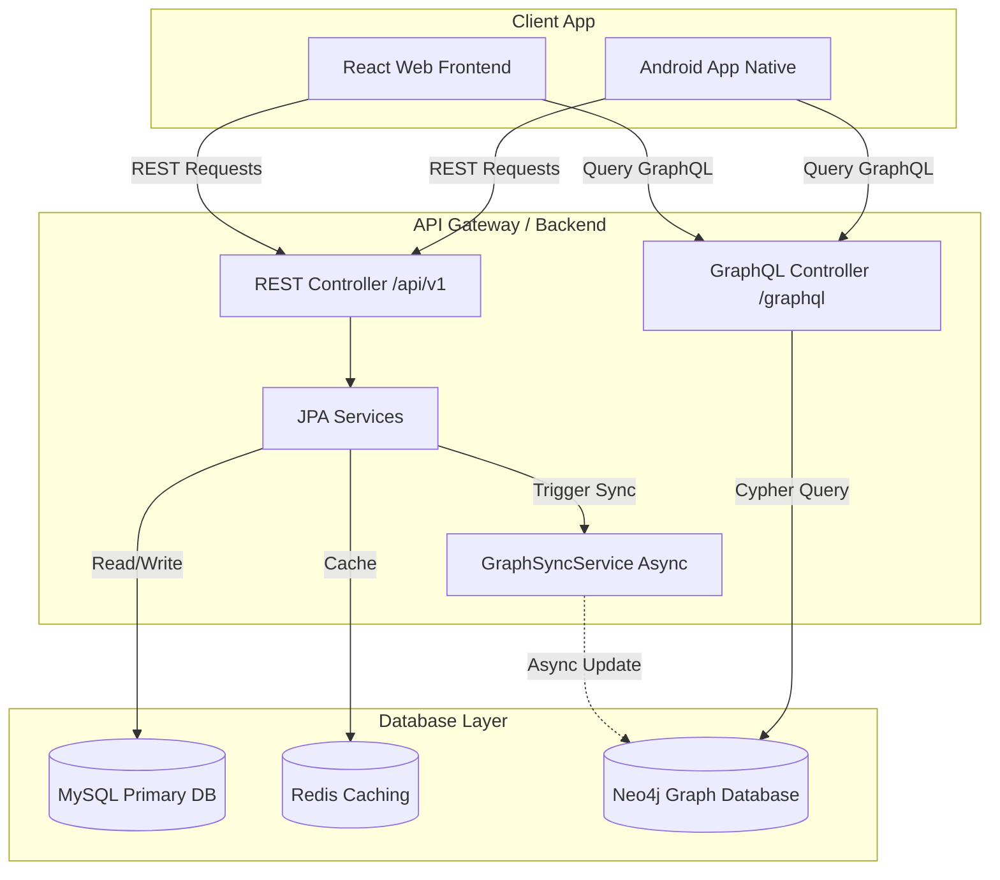
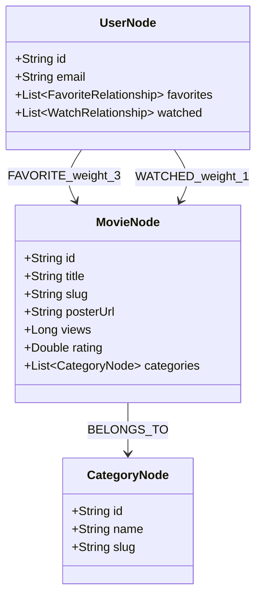

# Tài Liệu Kỹ Thuật: Hệ Thống Gợi Ý Phim CineStream (Neo4j & GraphQL)

Tài liệu này cung cấp cái nhìn chi tiết về kiến trúc, thuật toán, mô hình dữ liệu và cách tích hợp hệ thống gợi ý phim thông minh sử dụng Cơ sở dữ liệu đồ thị Neo4j và giao thức GraphQL cho hệ sinh thái CineStream (Web & Android).

---

## 1. Tổng Quan Kiến Trúc (Architecture Overview)

Hệ thống gợi ý phim của CineStream được thiết kế theo kiến trúc lai kết hợp Cơ sở dữ liệu quan hệ (MySQL), Cơ sở dữ liệu đồ thị (Neo4j) và cổng truy vấn GraphQL:



### Nguyên tắc hoạt động:
- **Primary Database (MySQL):** Là nguồn lưu trữ dữ liệu chính (Source of Truth) cho các thực thể quan hệ, đảm bảo tính nhất quán (ACID).
- **Graph Database (Neo4j):** Lưu trữ các nút đồ thị biểu diễn mối quan hệ giữa Người dùng (User), Phim (Movie), và Thể loại (Category). Chịu trách nhiệm thực hiện các truy vấn gợi ý phức tạp dựa trên thuật toán duyệt đồ thị.
- **GraphQL Endpoint:** Cung cấp cổng truy xuất dữ liệu độc lập giúp Web và Android tối ưu hóa băng thông bằng cách chỉ yêu cầu các trường dữ liệu cần thiết.

---

## 2. Mô Hình Đồ Thị (Graph Data Model)

Mô hình đồ thị trong Neo4j được ánh xạ qua các lớp thực thể Java Spring Data Neo4j (`com.tamdao.web_film_backend.entity.neo4j`):



### Các Mối Quan Hệ (Relationships) & Trọng Số (Weights):
- `(User)-[:FAVORITE]->(Movie)`: Trọng số **3.0** (Thể hiện sự yêu thích chủ động của người dùng).
- `(User)-[:WATCHED]->(Movie)`: Trọng số **1.0** (Thể hiện lịch sử xem của người dùng).
- `(Movie)-[:BELONGS_TO]->(Category)`: Liên kết phân loại nội dung phim.

---

## 3. Đường Ống Đồng Bộ Dữ Liệu (Data Sync Pipeline)

Để đảm bảo Neo4j luôn cập nhật dữ liệu mới nhất mà không gây nghẽn luồng xử lý chính của MySQL, toàn bộ tiến trình đồng bộ được thực hiện bất đồng bộ (Asynchronous) thông qua `GraphSyncService`:

### Các Điểm Kích Hoạt Đồng Bộ (Trigger Hooks):
1. **Yêu thích phim (`FavoriteService`):**
   - Khi người dùng thêm phim vào danh sách yêu thích $\rightarrow$ tạo liên kết `FAVORITE` trong Neo4j.
   - Khi hủy yêu thích $\rightarrow$ xóa liên kết `FAVORITE`.
2. **Lịch sử xem phim (`WatchHistoryService`):**
   - Khi tiến trình xem đạt mức ghi nhận $\rightarrow$ cập nhật liên kết `WATCHED` kèm thuộc tính cập nhật mới nhất.
3. **Crawl & Merge Phim mới (`DataMergerService`):**
   - Khi hệ thống crawler đẩy phim mới vào MySQL $\rightarrow$ đồng bộ dữ liệu phim và thể loại tương ứng sang đồ thị.

### Cơ chế phục hồi sự cố (Fault Tolerance):
- Mọi luồng ghi đồ thị đều được bao bọc trong khối `try-catch` riêng biệt. Nếu dịch vụ Neo4j tạm thời gián đoạn, luồng lưu trữ MySQL chính **không bao giờ bị ảnh hưởng** (đảm bảo dịch vụ cốt lõi luôn hoạt động liên tục).

---

## 4. Thuật Toán Gợi Ý (Cypher Recommendation Queries)

### 4.1. Gợi Ý Cá Nhân Hóa (Personalized Hybrid Recommendations)
Thuật toán tính điểm ưu tiên thể loại yêu thích dựa trên tổng trọng số hành vi của người dùng và lọc ra các phim người dùng chưa xem có cùng thể loại, sắp xếp kết hợp số lượt xem (popularity boost):

```cypher
// Bước 1: Tính toán sở thích thể loại của người dùng dựa trên lịch sử tương tác
MATCH (u:User {id: $userId})
OPTIONAL MATCH (u)-[r1:FAVORITE]->(m1:Movie)-[:BELONGS_TO]->(c:Category)
OPTIONAL MATCH (u)-[r2:WATCHED]->(m2:Movie)-[:BELONGS_TO]->(c:Category)
WITH c, 
     sum(coalesce(r1.weight, 3.0)) + sum(coalesce(r2.weight, 1.0)) AS categoryWeight

// Bước 2: Tìm những bộ phim cùng thể loại mà người dùng CHƯA xem
MATCH (rec:Movie)-[:BELONGS_TO]->(c)
WHERE NOT (u)-[:FAVORITE]->(rec) AND NOT (u)-[:WATCHED]->(rec)

// Bước 3: Tính điểm gợi ý kết hợp lượt xem thực tế (Views popularity)
WITH rec, sum(categoryWeight) AS baseScore
WITH rec, baseScore + 0.1 * log(coalesce(rec.views, 0) + 1) AS finalScore
RETURN rec
ORDER BY finalScore DESC
LIMIT 10
```

### 4.2. Gợi Ý Phim Tương Tự (Similar Movies)
Tìm các bộ phim có nhiều thể loại chung nhất với phim hiện tại, sắp xếp theo số lượng trùng khớp và mức độ phổ biến (lượt xem):

```cypher
MATCH (m:Movie {slug: $slug})-[:BELONGS_TO]->(c:Category)<-[:BELONGS_TO]->(rec:Movie)
WHERE m <> rec
RETURN rec, count(c) AS sharedCategories
ORDER BY sharedCategories DESC, rec.views DESC
LIMIT 5
```

---

## 5. Tích Hợp GraphQL Endpoint

Spring GraphQL tự động quét thư mục `src/main/resources/graphql` để phân tích schema:

### 5.1. GraphQL Schema (`schema.graphqls`)
```graphql
type Query {
    personalizedRecommendations: [MovieNode!]!
    similarMovies(slug: String!): [MovieNode!]!
}

type MovieNode {
    id: ID!
    title: String!
    slug: String!
    posterUrl: String
    views: Int
    rating: Float
}
```

### 5.2. Controller Resolver (`RecommendationGraphQLController.java`)
- Sử dụng `@QueryMapping` để nhận diện yêu cầu.
- Lấy đối tượng đăng nhập hiện hành từ `@AuthenticationPrincipal` để phục vụ gợi ý cá nhân hóa.

---

## 6. Triển Khai Trên Web & Mobile App

### 6.1. Tích Hợp React Web Frontend
GraphQL được truy vấn thông qua đối tượng Axios thiết lập sẵn có cơ chế gán Token tự động:

- **Hàm Dịch Vụ:**
  ```typescript
  getPersonalizedRecommendations: async (): Promise<Movie[]> => {
      const query = `query { personalizedRecommendations { id title slug posterUrl views rating } }`;
      const response = await api.post('/../graphql', { query });
      return response.data.data.personalizedRecommendations;
  }
  ```
- **Thành Phần Giao Diện:**
  - `HomePage.tsx`: Tự động gọi API gợi ý thông qua `useQuery` của `@tanstack/react-query` khi phát hiện trạng thái người dùng đã đăng nhập (`isAuthenticated`).
  - `RelatedMovies.tsx`: Nạp danh sách phim tương tự từ Neo4j cho trang chi tiết phim, tự động fallback về gợi ý thể loại SQL cũ nếu Neo4j lỗi hoặc không phản hồi.

### 6.2. Tích Hợp Android Native (Jetpack Compose)
Tối giản hóa ứng dụng bằng cách thực hiện truy vấn trực tiếp qua Retrofit thay vì cài đặt thư viện Apollo cồng kềnh:

- **Retrofit Api Client (`AuthApiService.kt`):**
  ```kotlin
  @POST("graphql")
  suspend fun getPersonalizedRecommendations(
      @Body request: GraphQLRequest = GraphQLRequest(
          query = "query { personalizedRecommendations { id title slug posterUrl views rating } }"
      )
  ): GraphQLResponse<PersonalizedRecommendationsData>
  ```
- **Hành vi luồng dữ liệu (ViewModel & UI):**
  - Khai báo state-flow `similarMovies` và `recommendedMovies` nạp song song với thông tin chi tiết.
  - Sử dụng thành phần Compose `LazyRow` và `AsyncImage` để dựng thanh trượt ngang tuyệt đẹp, tối ưu mượt mà tốc độ khung hình (fps).
